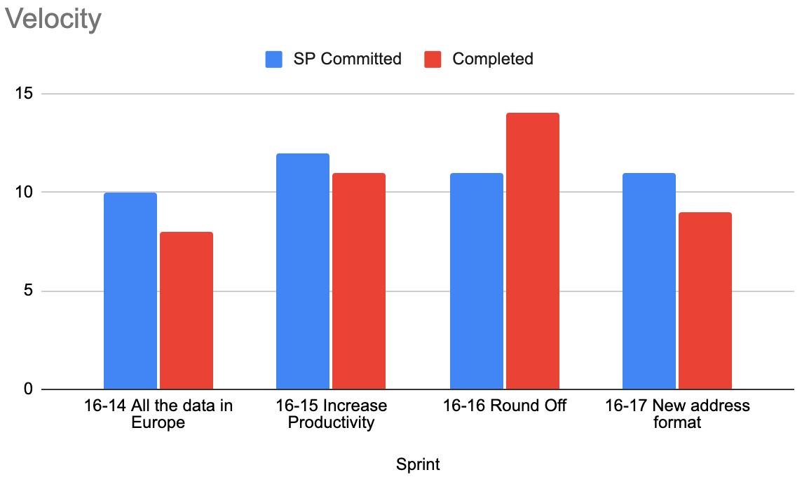
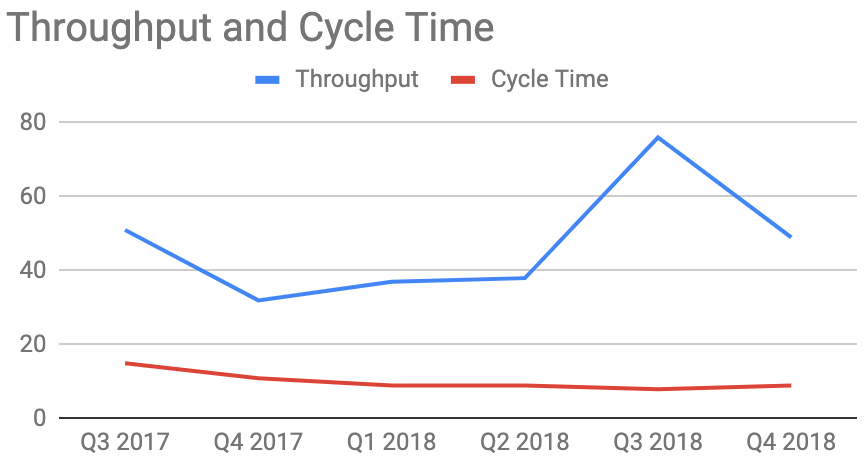

---
> **ARTS-week-21**
> 2023-05-20 09:35
---


## ARTS-2019 左耳听风社群活动--每周完成一个 ARTS
1.Algorithm: 每周至少做一个 leetcode 的算法题
2.Review: 阅读并点评至少一篇英文技术文章
3.Tip: 学习至少一个技术技巧
4.Share: 分享一篇有观点和思考的技术文章

### 1.Algorithm:

- [1373. 二叉搜索子树的最大键值和](https://leetcode.cn/submissions/detail/433774866/)  
    + 思路：BST
- [1079. 活字印刷](https://leetcode.cn/submissions/detail/433553653/)  
    + 思路：DFS
- [1073. 负二进制数相加](https://leetcode.cn/submissions/detail/433293257/)  
    + 思路：队列

### 2.Review:

[在 Elasticsearch 中将副本分片提升为主分片，以及它如何在滚动重启期间为我们节省 12，000 美元](https://underthehood.meltwater.com/blog/2021/07/26/maturing-as-an-agile-coach/)

有没有被问到“随着团队的成熟，敏捷教练的影响会如何变化”？为了探索这个问题，我将描述我作为敏捷教练在一个团队工作2年的经历。在那段时间里，我将研究我在团队中的影响是如何变化的，经历了不同的成熟阶段，以及我试图找到衡量我影响的方法。

#### 1、6个月：基础知识

在与开发团队合作的前 6 个月里，我们做了很多学习，并了解了我们都想如何作为一个团队一起工作。我们有一个最初的团队启动仪式，我们讨论了角色和责任，并更多地了解了彼此作为一个团队，并就我们作为一个团队的使命保持一致。

启动后，我们运行了典型的Scrum流程：

- 1.我们有站立会议

- 2.在看板上可视化工作

- 3.利用回顾进行持续改进

- 4.进行冲刺计划和积压工作细化。

在此期间，团队能够基于这些基本原则和实践进行构建，并开始迭代地交付业务价值。我们正在完成冲刺，并且速度一致。然后，我必须确定我们的下一个成熟阶段是什么。

##### 使用的指标：

 - 我们测量了每个冲刺的速度和完成的故事，以帮助进行规划。他们一致吗？还是改善？


#### 2、1 年：减少浪费和交付时间

在前 6 个月之后，我向团队介绍了看板和精益原则（流程、WIP 限制和消除瓶颈）。当我们应用这些实践并巩固我们的敏捷流程时，团队也在加强他们的敏捷开发实践，他们正在使用XP实践（结对编程，代码审查）实践持续交付。现在的挑战是通过减少浪费和缩短交货时间来找到优化流程的方法。

通过观察和倾听团队的意见，出现了一个主题，即希望简化我们的发布流程并减少团队内部的知识孤岛。我与团队中的一位工程师配对，并进行了一次练习，绘制了我们的开发和部署管道的流程。

- 功能如何从头到尾进行？

- 它经过什么环境？

- 我们在哪里看到最多的瓶颈？

我们研究了这个流程，并开始确定我们可以消除浪费的领域，并删除开发过程中不需要的步骤。我们能够在暂存之前确定我们不需要环境，并能够将其删除。这反过来又通过减少团队成员必须管理的环境来减少浪费。

##### 使用的指标：

 - 部署时间和部署停机时间。这些减少了吗？=> 是
 - 吞吐量，它是否增加了，保持可预测性？=> 是和否，从图表中可以看出，它通常会增加，但由于团队规模的变化（成员离开），吞吐量随着时间的推移而变化。
 - 周期时间（从工单开始工作到生产的天数）。=> 减少




#### 3、1.5年：规划大型项目的迭代开发

随着团队表现的成熟，我的日常影响略有减弱。该团队能够运行站立会议，找到分解复杂功能以首先交付价值的方法，并自行推动项目。现在是我的下一个挑战，看看如何调整我的风格以适应更成熟的团队。

大约在这个时候，团队的任务是开发一个新的面向客户的应用程序。这给我们带来了新的挑战，因为该团队主要是内部工具的后端团队。面对这个新的挑战，我们必须计划如何构建一个全新的面向公众的应用程序，这是我们不经常做的事情。在真正的敏捷方式中，我们希望找到可以交付给客户的第一个切片，以便尽早获得反馈，并满足法律合规性的最后期限。

我与产品负责人 （PO） 一起思考如何最好地向团队展示新应用程序的概念。利用我在促进和团队动态方面的知识，我们配对在一起计划一个故事映射练习。我们进行了一次故事映射练习，其中 PO 使用带有便笺的物理板展示了第一个版本所需的基本用户功能的工作流程。

##### 使用的指标：
 - 第一个版本发布的截止日期。我们达到目标了吗？用户是否能够在 12 月 31 日之前注册我们的服务？=> 是
 - 团队成员是否对会议后我们将要构建的内容有了更多的了解？=> 是

#### 4、2.0+ 年：在团队和公司内推广敏捷文化

我对我的团队和组织产生的最大影响是通过促进和创造敏捷文化。上面的例子提供了我为灌输和实践这些价值观而进行的具体活动。随着团队的成熟，在日常仪式中不太依赖我，它使我能够从事更多的组织计划，例如......
 - 通过公会会议/聚会和博客文章推广敏捷社区
 - 启动新团队并指导他们
 - 为不同业务领域规划和促进更大的规划和研讨会
 - 向新的业务部门教授敏捷

#### 5、总结
回顾我过去2.5年与一支球队的经历，是展示教练的影响如何随着团队成熟而变化的好方法。根据我的经验，确保Scrum仪式最有效可能是大部分时间的重点，但随着团队的成熟，会发现其他领域可以有所作为。通过与团队的日常工作以及倾听和观察团队，将能够了解如何发挥最大影响力以及需要做出哪些改变。

在团队的生命周期中，与团队的体验发生了怎样的变化？如何衡量在不同阶段的影响？作为一名教练，在与团队合作的过程中，是如何成熟的？我们很乐意在下面的评论中收到的来信。

### 3.Tip:

#### jQuery 中使用工作流程图 bpmn-js.js 初始化、预览

流程图设计：Modeler

```html
<link rel="stylesheet" href="https://unpkg.com/bpmn-js@7.2.0/dist/assets/diagram-js.css" />
<link rel="stylesheet" href="https://unpkg.com/bpmn-js@7.2.0/dist/assets/bpmn-font/css/bpmn.css" />
<script src="https://unpkg.com/bpmn-js@7.2.0/dist/bpmn-modeler.development.js"></script>
```

使用流程图控件设计流程图
```javascript
1 <div id="canvas"> </div>
 2 <script>
 3     $(function(){
 4         var BpmnModeler = window.BpmnJS;
 5         var xml = "<?xml version='1.0' encoding='UTF-8'?><definitions xmlns='http://www.omg.org/spec/BPMN/20100524/MODEL' xmlns:bpmndi='http://www.omg.org/spec/BPMN/20100524/DI' xmlns:omgdi='http://www.omg.org/spec/DD/20100524/DI' xmlns:omgdc='http://www.omg.org/spec/DD/20100524/DC' xmlns:xsi='http://www.w3.org/2001/XMLSchema-instance' id='sid-38422fae-e03e-43a3-bef4-bd33b32041b2' targetNamespace='http://bpmn.io/bpmn' exporter='bpmn-js (https://demo.bpmn.io)' exporterVersion='5.1.2'><process id='Process_1' isExecutable='false'><startEvent id='StartEvent_1y45yut' name='开始'><outgoing>SequenceFlow_0h21x7r</outgoing></startEvent><task id='Task_1hcentk' name='审批'><incoming>SequenceFlow_0h21x7r</incoming><outgoing>SequenceFlow_06o0wf0</outgoing></task><sequenceFlow id='SequenceFlow_0h21x7r' sourceRef='StartEvent_1y45yut' targetRef='Task_1hcentk' /><task id='Task_13intos' fill='red' name='下一节点'><incoming>SequenceFlow_06o0wf0</incoming><outgoing>SequenceFlow_1oydyx4</outgoing></task><sequenceFlow id='SequenceFlow_06o0wf0' sourceRef='Task_1hcentk' targetRef='Task_13intos' /><endEvent id='EndEvent_0aot3cz' name='结束'><incoming>SequenceFlow_1oydyx4</incoming></endEvent><sequenceFlow id='SequenceFlow_1oydyx4' sourceRef='Task_13intos' targetRef='EndEvent_0aot3cz' /></process><bpmndi:BPMNDiagram id='BpmnDiagram_1'><bpmndi:BPMNPlane id='BpmnPlane_1' bpmnElement='Process_1'><bpmndi:BPMNShape id='StartEvent_1y45yut_di' bpmnElement='StartEvent_1y45yut'><omgdc:Bounds x='152' y='102' width='36' height='36' /><bpmndi:BPMNLabel><omgdc:Bounds x='160' y='145' width='22' height='14' /></bpmndi:BPMNLabel></bpmndi:BPMNShape><bpmndi:BPMNShape id='Task_1hcentk_di' bpmnElement='Task_1hcentk'><omgdc:Bounds x='240' y='80' width='100' height='80' /></bpmndi:BPMNShape><bpmndi:BPMNEdge id='SequenceFlow_0h21x7r_di' bpmnElement='SequenceFlow_0h21x7r'><omgdi:waypoint x='188' y='120' /><omgdi:waypoint x='240' y='120' /></bpmndi:BPMNEdge><bpmndi:BPMNShape id='Task_13intos_di' bpmnElement='Task_13intos'><omgdc:Bounds x='400' y='80' width='100' height='80' /></bpmndi:BPMNShape><bpmndi:BPMNEdge id='SequenceFlow_06o0wf0_di' bpmnElement='SequenceFlow_06o0wf0'><omgdi:waypoint x='340' y='120' /><omgdi:waypoint x='400' y='120' /></bpmndi:BPMNEdge><bpmndi:BPMNShape id='EndEvent_0aot3cz_di' bpmnElement='EndEvent_0aot3cz'><omgdc:Bounds x='562' y='102' width='36' height='36' /><bpmndi:BPMNLabel><omgdc:Bounds x='569' y='145' width='22' height='14' /></bpmndi:BPMNLabel></bpmndi:BPMNShape><bpmndi:BPMNEdge id='SequenceFlow_1oydyx4_di' bpmnElement='SequenceFlow_1oydyx4'><omgdi:waypoint x='500' y='120' /><omgdi:waypoint x='562' y='120' /></bpmndi:BPMNEdge></bpmndi:BPMNPlane></bpmndi:BPMNDiagram></definitions>"; // ADD BPMN 2.0 XML HERE
 6         var modeler = new BpmnModeler({ 7             container: '#canvas'
 8         });
 9         modeler.importXML(xml, function(err) {10             if (err) {
11                 console.log('error rendering', err);
12             } else {
13                 console.log('rendered');
14             }
15         });
16     });
17 </script>
```

流程图预览：Viewer
```html
<link rel="stylesheet" href="https://unpkg.com/bpmn-js@7.2.0/dist/assets/diagram-js.css" />
<link rel="stylesheet" href="https://unpkg.com/bpmn-js@7.2.0/dist/assets/bpmn-font/css/bpmn.css" />
<script src="https://unpkg.com/bpmn-js@7.2.0/dist/bpmn-viewer.development.js"></script>
```

使用流程图控件预览流程图
```javascript
<div id="viewer"> </div>
<script>
    $(function(){
        var BpmnViewer = window.BpmnJS;
        var xml = "<?xml version='1.0' encoding='UTF-8'?><definitions xmlns='http://www.omg.org/spec/BPMN/20100524/MODEL' xmlns:bpmndi='http://www.omg.org/spec/BPMN/20100524/DI' xmlns:omgdi='http://www.omg.org/spec/DD/20100524/DI' xmlns:omgdc='http://www.omg.org/spec/DD/20100524/DC' xmlns:xsi='http://www.w3.org/2001/XMLSchema-instance' id='sid-38422fae-e03e-43a3-bef4-bd33b32041b2' targetNamespace='http://bpmn.io/bpmn' exporter='bpmn-js (https://demo.bpmn.io)' exporterVersion='5.1.2'><process id='Process_1' isExecutable='false'><startEvent id='StartEvent_1y45yut' name='开始'><outgoing>SequenceFlow_0h21x7r</outgoing></startEvent><task id='Task_1hcentk' name='审批'><incoming>SequenceFlow_0h21x7r</incoming><outgoing>SequenceFlow_06o0wf0</outgoing></task><sequenceFlow id='SequenceFlow_0h21x7r' sourceRef='StartEvent_1y45yut' targetRef='Task_1hcentk' /><task id='Task_13intos' fill='red' name='下一节点'><incoming>SequenceFlow_06o0wf0</incoming><outgoing>SequenceFlow_1oydyx4</outgoing></task><sequenceFlow id='SequenceFlow_06o0wf0' sourceRef='Task_1hcentk' targetRef='Task_13intos' /><endEvent id='EndEvent_0aot3cz' name='结束'><incoming>SequenceFlow_1oydyx4</incoming></endEvent><sequenceFlow id='SequenceFlow_1oydyx4' sourceRef='Task_13intos' targetRef='EndEvent_0aot3cz' /></process><bpmndi:BPMNDiagram id='BpmnDiagram_1'><bpmndi:BPMNPlane id='BpmnPlane_1' bpmnElement='Process_1'><bpmndi:BPMNShape id='StartEvent_1y45yut_di' bpmnElement='StartEvent_1y45yut'><omgdc:Bounds x='152' y='102' width='36' height='36' /><bpmndi:BPMNLabel><omgdc:Bounds x='160' y='145' width='22' height='14' /></bpmndi:BPMNLabel></bpmndi:BPMNShape><bpmndi:BPMNShape id='Task_1hcentk_di' bpmnElement='Task_1hcentk'><omgdc:Bounds x='240' y='80' width='100' height='80' /></bpmndi:BPMNShape><bpmndi:BPMNEdge id='SequenceFlow_0h21x7r_di' bpmnElement='SequenceFlow_0h21x7r'><omgdi:waypoint x='188' y='120' /><omgdi:waypoint x='240' y='120' /></bpmndi:BPMNEdge><bpmndi:BPMNShape id='Task_13intos_di' bpmnElement='Task_13intos'><omgdc:Bounds x='400' y='80' width='100' height='80' /></bpmndi:BPMNShape><bpmndi:BPMNEdge id='SequenceFlow_06o0wf0_di' bpmnElement='SequenceFlow_06o0wf0'><omgdi:waypoint x='340' y='120' /><omgdi:waypoint x='400' y='120' /></bpmndi:BPMNEdge><bpmndi:BPMNShape id='EndEvent_0aot3cz_di' bpmnElement='EndEvent_0aot3cz'><omgdc:Bounds x='562' y='102' width='36' height='36' /><bpmndi:BPMNLabel><omgdc:Bounds x='569' y='145' width='22' height='14' /></bpmndi:BPMNLabel></bpmndi:BPMNShape><bpmndi:BPMNEdge id='SequenceFlow_1oydyx4_di' bpmnElement='SequenceFlow_1oydyx4'><omgdi:waypoint x='500' y='120' /><omgdi:waypoint x='562' y='120' /></bpmndi:BPMNEdge></bpmndi:BPMNPlane></bpmndi:BPMNDiagram></definitions>"; // ADD BPMN 2.0 XML HERE
        var viewer = new BpmnViewer({
            container: '#viewer'
        });
        viewer.importXML(xml, function(err) {
            if (err) {
                console.log('error rendering', err);
            } else {
                console.log('rendered');
            }
        });
    });
</script>
```

流程图汉化
```html
<link rel="stylesheet" href="bpmn/css/bpmn.css" />
<link rel="stylesheet" href="bpmn/css/diagram-js.css" />

<script type="text/javascript" src="../js/jquery.js" ></script>
<script src="bpmn/bpmn-modeler.development.js"></script>
//汉化
<script type="text/javascript" src="bpmn/sinicization/customTranslate.js" ></script>
```

初始化
```javascript
$(function(){
    var BpmnModeler = window.BpmnJS;
    //此处为汉化对象
    var customTranslateModule = {
      translate: [ 'value',  customTranslate]
    };
    var xml = "<?xml version='1.0' encoding='UTF-8'?><definitions xmlns='http://www.omg.org/spec/BPMN/20100524/MODEL' xmlns:bpmndi='http://www.omg.org/spec/BPMN/20100524/DI' xmlns:omgdi='http://www.omg.org/spec/DD/20100524/DI' xmlns:omgdc='http://www.omg.org/spec/DD/20100524/DC' xmlns:xsi='http://www.w3.org/2001/XMLSchema-instance' id='sid-38422fae-e03e-43a3-bef4-bd33b32041b2' targetNamespace='http://bpmn.io/bpmn' exporter='bpmn-js (https://demo.bpmn.io)' exporterVersion='5.1.2'><process id='Process_1' isExecutable='false'><startEvent id='StartEvent_1y45yut' name='开始'><outgoing>SequenceFlow_0h21x7r</outgoing></startEvent><task id='Task_1hcentk' name='审批'><incoming>SequenceFlow_0h21x7r</incoming><outgoing>SequenceFlow_06o0wf0</outgoing></task><sequenceFlow id='SequenceFlow_0h21x7r' sourceRef='StartEvent_1y45yut' targetRef='Task_1hcentk' /><task id='Task_13intos' fill='red' name='下一节点'><incoming>SequenceFlow_06o0wf0</incoming><outgoing>SequenceFlow_1oydyx4</outgoing></task><sequenceFlow id='SequenceFlow_06o0wf0' sourceRef='Task_1hcentk' targetRef='Task_13intos' /><endEvent id='EndEvent_0aot3cz' name='结束'><incoming>SequenceFlow_1oydyx4</incoming></endEvent><sequenceFlow id='SequenceFlow_1oydyx4' sourceRef='Task_13intos' targetRef='EndEvent_0aot3cz' /></process><bpmndi:BPMNDiagram id='BpmnDiagram_1'><bpmndi:BPMNPlane id='BpmnPlane_1' bpmnElement='Process_1'><bpmndi:BPMNShape id='StartEvent_1y45yut_di' bpmnElement='StartEvent_1y45yut'><omgdc:Bounds x='152' y='102' width='36' height='36' /><bpmndi:BPMNLabel><omgdc:Bounds x='160' y='145' width='22' height='14' /></bpmndi:BPMNLabel></bpmndi:BPMNShape><bpmndi:BPMNShape id='Task_1hcentk_di' bpmnElement='Task_1hcentk'><omgdc:Bounds x='240' y='80' width='100' height='80' /></bpmndi:BPMNShape><bpmndi:BPMNEdge id='SequenceFlow_0h21x7r_di' bpmnElement='SequenceFlow_0h21x7r'><omgdi:waypoint x='188' y='120' /><omgdi:waypoint x='240' y='120' /></bpmndi:BPMNEdge><bpmndi:BPMNShape id='Task_13intos_di' bpmnElement='Task_13intos'><omgdc:Bounds x='400' y='80' width='100' height='80' /></bpmndi:BPMNShape><bpmndi:BPMNEdge id='SequenceFlow_06o0wf0_di' bpmnElement='SequenceFlow_06o0wf0'><omgdi:waypoint x='340' y='120' /><omgdi:waypoint x='400' y='120' /></bpmndi:BPMNEdge><bpmndi:BPMNShape id='EndEvent_0aot3cz_di' bpmnElement='EndEvent_0aot3cz'><omgdc:Bounds x='562' y='102' width='36' height='36' /><bpmndi:BPMNLabel><omgdc:Bounds x='569' y='145' width='22' height='14' /></bpmndi:BPMNLabel></bpmndi:BPMNShape><bpmndi:BPMNEdge id='SequenceFlow_1oydyx4_di' bpmnElement='SequenceFlow_1oydyx4'><omgdi:waypoint x='500' y='120' /><omgdi:waypoint x='562' y='120' /></bpmndi:BPMNEdge></bpmndi:BPMNPlane></bpmndi:BPMNDiagram></definitions>"; // ADD BPMN 2.0 XML HERE
    var modeler = new BpmnModeler({
        container: '#canvas',
        additionalModules:[
            customTranslateModule
        ]
    });


    modeler.importXML(xml, function(err) {
        if (err) {
            console.log('error rendering', err);
        } else {
            console.log('rendered');
        }
    });
});
```

### 4.Share:

[最好用的流程编辑器bpmn-js系列之基本使用](https://blog.ops-coffee.cn/s/niqztauj16pbq3i05lsuca)

[bpmn官网](https://bpmn.io/toolkit/bpmn-js/examples/)

[form-js-在线编辑](https://codesandbox.io/s/form-js-starter-xvvzo?file=/src/index.js)

[form-js-examples](https://github.com/bpmn-io/form-js-examples)

[Vue 整合Bpmn-js 工作流模型编辑器](https://juejin.cn/post/6844904069736169480)  

[Bpmn.js 在线流程编辑器的汉化](https://juejin.cn/post/6844904105954000910)

[全网最详bpmn.js教材目录](https://juejin.cn/post/6844904017567416328)

[批量转换UTF-8工具](https://zhuanlan.zhihu.com/p/585163944)

[.](https://gitee.com/zsvg/vboot-java)