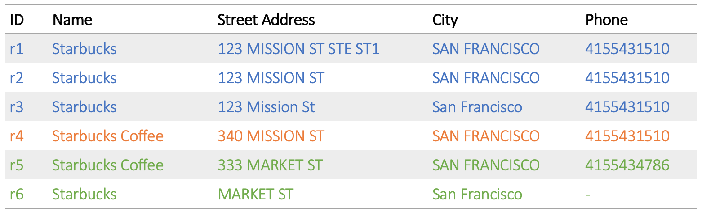

---
> **ARTS-week-22**
> 2023-05-28 08:06
---

## ARTS-2019 左耳听风社群活动--每周完成一个 ARTS
1.Algorithm： 每周至少做一个 leetcode 的算法题
2.Review: 阅读并点评至少一篇英文技术文章
3.Tip: 学习至少一个技术技巧
4.Share: 分享一篇有观点和思考的技术文章

### 1.Algorithm:

- [1053. 交换一次的先前排列](https://leetcode.cn/problems/previous-permutation-with-one-swap/)  
    + 思路：贪心
- [1091. 二进制矩阵中的最短路径](https://leetcode.cn/submissions/detail/435677610/)  
    + 思路：BFS
- [1439. 有序矩阵中的第 k 个最小数组和](https://leetcode.cn/submissions/detail/435677927/)  
    + 思路：优先队列

### 2.Review:

[知识图谱的记录链接管道（第 1 部分）](https://underthehood.meltwater.com/blog/2020/06/29/the-record-linking-pipeline-for-our-knowledge-graph-part-1/)

Meltwater最近发布了一个名为Signals的新产品功能，可帮助我们的客户识别关键业务事件。为这些信号提供支持的技术系统之一是定制的知识图谱。

在这篇文章中，我们解释了我们如何创建一个记录链接服务，该服务利用机器学习和大数据策略来聚类来自各种来源的数百万个相关实体，并高精度地构建我们的知识图谱。

由于我们正在深入研究材料，这篇文章适用于对数据科学或数据工程感兴趣的软件工程师。

#### 1、什么是记录链接？

记录链接，也称为实体解析，是一种对数据库记录/知识库条目进行聚类的方法，使得每个集群对应于单个不同的现实世界实体（例如，企业、个人）。这是数据清理和数据集成的关键步骤。

例如，考虑以下 6 个商家信息，每个商家信息由来自不同来源的 4 个属性（名称、街道地址、城市和电话号码）表示：

这些记录的正确聚类是 3 个聚类，对应于 3 个实际的星巴克门店（如上图颜色所示）：
r1,r2,r3 形成第一个集群，r4 第二个和 r5,r6 第三个。

#### 2、记录链接的挑战

最常见的挑战是相关记录的属性值通常与字面上不匹配，就像在记录中一样r1和r2在下面的例子中，两者都是关于苹果的首席执行官：

但是，某些属性具有相同的值并不一定意味着分配给相同的聚类（记录的人名）r1和r3以上）。另一方面，对于仍需要进入同一集群的记录，某些属性值可能根本不匹配（记录的隶属关系属性r3, r4以上）。

我们有时还需要处理不完整的记录（缺少属性值），如上面的星巴克记录示例r6.

最后但并非最不重要的一点是，输入中的数百万条记录会导致大数据约束。我们的解决方案必须是：
 - 可扩展。例如，将每条记录与其他每条记录进行比较以查找聚类将需要n∗(n−1)/2=O(n2)的比较n记录，这将是不可接受的运行时复杂性（如果处理 100K 条记录需要 60 秒，则处理 1M 将需要 6，000 秒）
 - 可并行化，因此我们可以通过在物理硬件集群上并行执行计算来进一步减少处理时间。

#### 3、知识图谱的记录链接

知识图谱（KG）是一个图形结构的数据库，其中顶点表示业务实体，如组织，关键人物，行业，股票指数，地址等，而边缘表示关系，如隶属关系，子公司，行业协会或并购等事件等。KG的核心融合自10 +不同的知识来源，包括维基数据或Crunchbase等结构化数据库。通过链接实体并在编辑和社交内容中添加由NLP算法识别的关系，该核心不断丰富，Meltwater每天收获数百万人。

记录链接是合并来自不同来源的数据的关键步骤，有助于KG。举个例子，这里是Meltwater Group的维基数据条目和Crunchbase条目。我们希望有一个代表Meltwater Group 的图形顶点，从源记录中的知识组合出来，而不是将每个图形顶点分开，这将是重复的，因此是一个错误。

#### 4、记录链接管道

记录链接工作流集成到提取、转换和融合形成 KG 的数据的管道中，由以下步骤组成：

- 1.所有传入的源数据记录都经过验证并映射到我们称为KG本体的通用数据模式上，因此无论数据来自何处，我们都能够使用“通用语言”引用所有属性。
- 2.避免必须执行O(n2)成对比较，我们首先将数据划分为共享阻塞键的记录块。这些是使用易于计算的函数计算的类似哈希的值，选择这些值是为了最大限度地减少需要属于同一集群的记录被分配给不同块的概率。
- 3.然后，监督式机器学习分类器比较相同块中的所有记录，并为每个记录对分配介于 0.0（单相同）和 1.0（相同）之间的概率分数。分类器学习每个属性在确定两个记录是否相同的过程中所扮演的“权重”。
- 4.然后将分层聚集聚类应用于由分类器为每个块计算的相似性矩阵。这是一个迭代过程，合并 2 个最相似的记录/聚类，直到达到预定的聚类间相似性阈值水平。与其他记录/分类不够相似的记录将分配其自己的单一实例分类。
- 5.最后，源记录集群通过我们的TruthFinder 算法实现融合到最终的 KG 顶点中。此过程能够在学习过程的帮助下组合来自各种来源的冲突属性值。

我们在Apache Spark之上实现了 Python 中的记录链接，以实现并行处理，从而允许我们在 AWS Elastic MapReduce （EMR） 集群上以分布式方式运行作业。机器学习代码基于Spark的MLlib。

在下一节中，我们将详细介绍两种最重要/最具挑战性的 KG 类型（组织和人员）的阻止和机器学习步骤。

#### 5、型号：第一版
##### 组织
为了训练组织记录链接的相似性模型，我们从 4 个数据源中精心挑选了 18 条公司记录，这些数据源映射到 7 个手动识别的集群。我们通过从集群中获取所有可能的记录对组合，创建了 36 个正训练示例（“相同”的记录对）。135个负训练样本（“不相同”的记录对）由不同集群的所有2种记录组合组成。

训练示例（正记录或负记录对）必须转换为特征向量（浮点数的 n 元组），以便由 ML 算法（逻辑回归）解释。每个记录对的要素值计算公式为:
- 将自定义规范化函数应用于属性值
- 将相似性（距离）函数应用于规范化属性值对。

对于组织，我们使用了 2 个属性，组织名称和主页 URL。组织名称的规范化包括：
- 删除前缀（如“The”）或标记（如所有格“'s”）
- 删除公司后缀，如“Inc.”、“Corp.”、“Group”等。
- 用于规范大小写、重音和标点符号变化的段子词。
为了比较规范化的OrganizationName值，我们使用了最小Jaro-Winkler 距离，这是一种编辑距离字符串相似性指标，可为从一开始就匹配的字符串提供更有利的评级。“最小”是指如果两侧有多个名称变体要比较，我们返回所有可能对之间计算的最小距离。

我们通过删除除子域、域、顶级域和 URL 的路径部分之外的所有内容来规范化首页网址。作为我们的相似性函数，我们在这种情况下选择了最小归一化列文施泰因距离（范围限制为 [0， 1]）。

下表说明了由其组织名称和主页 URL属性表示的一对公司记录的规范化和相似性特征生成：

在训练期间，逻辑回归模型学习n=2参数，用于定义最佳 n 维形状，用于分隔 n 维特征空间中的正负训练示例。然后，当我们应用模型在记录链接期间获得相似性预测时，这些学习的参数值将用作相应特征值的权重。

对于组织记录的阻止，我们使用其主页URL属性的域部分作为阻止键（例如，在上面示例中，两个URL都是“acme”）。这种简单的方法允许一个很好的初步估计。在随后的实验中，我们必须创建一个网站“托管”域的白名单，如 wordpress.com、sites.google.com、facebook.com等。对于这样的 URL，我们将路径部分保留在阻止键中，例如。“脸书/极致”。这有助于通过避免形成不必要的大块来纠正 Spark worker 的内存不足故障（例如，所有在wordpress.com上拥有网页的组织最终都会处于同一块中）。

##### 人
为了训练人员相似性模型的第一个版本，我们通过利用包含人员记录的两个数据源之间的隐式链接来创建训练示例。我们的维基数据源对其许多条目都有对维基百科URL的引用，这些条目可以自动转换为DBpedia URL，它唯一地标识其他来源中的条目。

我们通过随机抽样自动链接的维基数据和DBpedia人员记录对生成了5，000个积极的训练对。为了使训练集多样化，我们创建了两种类型的负训练示例：5，000 个“近负”对，其中第一条记录的规范化名称等于或相似另一条记录，但该对没有链接，另外 5，000 个随机选择、未链接、不相关的“远负”记录对。

我们对“人名”、“出生日期”和“性别”属性使用了以下规范化方法：
- 人名规范化#1：蛞蝓化以折叠标点符号，重音和大写差异，例如。汉斯·安德烈·延森 → 汉斯-安德烈-延森
- 人名规范化#2：解析名字以将名字和姓氏部分与其他部分（中间名，头衔等）分开，然后使用字典将名字转换为正式版本，并仅以姓氏重新连接，例如。蒂莫西·唐纳德·库克、蒂姆·库克→蒂莫西·库克
- 出生日期：识别并规范化年、月和日部分（如果可用）
- 性别：将值映射到“女性”、“男性”或“其他”之一

通过实验，我们发现这 8 个特征为分类器提供了最佳评估指标：
- 来自PersonName规范化 #1 和 #2 精确匹配的二进制特征：如果两个记录共享至少一个规范化名称，则返回“1”，否则返回“0”
- 来自标准化BirthDate 的 3 个二进制特征：Y & M&D 部分的精确匹配，或者只是 Y &M 部分或仅 Y 部分
- 来自归一化性别值精确匹配的二进制特征
- 2 个特殊的二进制功能，用于编码出生日期和性别两侧的值是否缺失。这通过强制模型区分非缺失的不相等值和由于缺失值而导致的不等式来提高分类准确性。

对于人员记录的阻止，我们使用 PersonName 规范化 #2 中的 slugized 值作为阻止键，例如：
- 吉姆·哈克特、詹姆斯·哈克特→詹姆斯-哈克特
- 罗伯特·艾格，鲍勃·艾格→罗伯特·艾格
- 小唐纳德·M·凯西、唐纳德·凯西→唐纳德-凯西

### 3.Tip:

#### 报错 Mockito can only mock non-private & non-final classes
解决方案：更换mockito-core的版本，我一开始使用2.27.0版本，报错，换成2.16.0版本，就可以正常运行了

### 4.Share:

[jQuery中如何使用工作流程图bpmn-js.js 汉化](https://www.cnblogs.com/keyi666/p/13086907.html)

[在SpringBoot中配置多个cache，实现多个cacheManager灵活切换](https://blog.csdn.net/s674334235/article/details/82593899)
