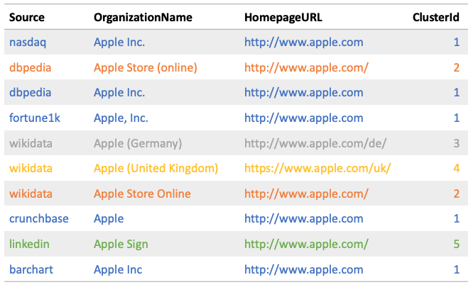
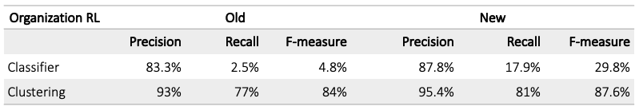
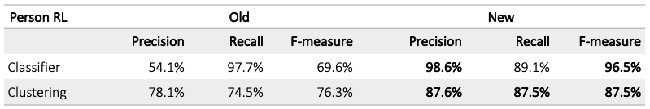

---
> **ARTS-week-23**
> 2023-06-03 09:52
---


## ARTS-2019 左耳听风社群活动--每周完成一个 ARTS
1.Algorithm： 每周至少做一个 leetcode 的算法题
2.Review: 阅读并点评至少一篇英文技术文章
3.Tip: 学习至少一个技术技巧
4.Share: 分享一篇有观点和思考的技术文章

### 1.Algorithm:

- [2517. 礼盒的最大甜蜜度](https://leetcode.cn/submissions/detail/436707661/)  
    + 思路：二分
- [2559. 统计范围内的元音字符串数](https://leetcode.cn/submissions/detail/436963420/)  
    + 思路：前缀和
- [1156. 单字符重复子串的最大长度](https://leetcode.cn/submissions/detail/437191785/)  
    + 思路：滑动窗口

### 2.Review:

[改进知识图谱的记录链接（第 2 部分）](https://underthehood.meltwater.com/blog/2020/07/10/improving-record-linking-for-our-knowledge-graph-part-2/)

Meltwater最近发布了一个名为Signals的新产品功能，可帮助我们的客户识别关键业务事件。为这些信号提供支持的技术系统之一是定制的知识图谱。

在上一篇文章中，我们介绍了记录链接的概念，并介绍了我们的第一个方法，用于合并来自多个来源的信息，用于我们的知识图谱。

在第二篇文章中，我们分享了我们如何根据用户反馈和对学习功能的分析来改进这些初始模型，并提出了正式的评估指标。

#### 1、改进的组织模型

有关上下文，请参阅我们之前的博客文章，其中我们介绍了基于阻塞、机器学习分类器和聚集聚类的记录链接。该帖子还描述了我们链接类似组织和人员实体的第一个模型。

随着知识图谱（KG）被分阶段用于服务应用程序，更多的人机在环工作被引导到质量控制上。我们收到了以手动标记KG中可疑重复组织顶点的公司记录的形式的反馈（记录链接的漏报）。

用这些新实例来扩充我们的训练数据是合乎逻辑的一步，因为这些实例代表了比我们从中引导初始模型的合成示例更真实的用例。

我们还想改进模型本身所学到的知识，所以我们决定修改训练功能。为了实现这一目标，我们将新数据分为训练和测试部分，并在对原始模型的假阳性和假阴性预测进行分析和分类后测试改进想法。

我们为主页URL属性设计了一种改进的规范化方法，该方法丢弃了常见的URL路径模式（例如。/home， /index.html， /en-usetc.）因此，模型可以专注于确实有所作为的路径（例如。amazon.com与 amazon.com/dash）。基于此，我们添加了一个新的 3 值二进制功能以实现精确匹配（以 .5 的分数表示两侧的缺失值）。我们还引入了一个新功能，用于URL对顶级域的3值匹配，希望这有助于区分国际子公司，这是我们需要经常做的事情，例如。amazon.com vs.amazon.co.uk。

对于 OrganizationName 属性，我们添加了一个新的二进制功能，用于表示两个名称中的任何一个是另一个名称的前缀还是后缀，例如。Dominion vs.Dominion Energy，Digital Realty Trust vs.Digital Realty。最后，我们添加了三个全新的 3 值二进制功能，用于规范化社交媒体句柄之间的精确匹配，这些句柄源自公司的 Facebook、Twitter 和LinkedInURL属性。

在具有改进功能的新数据上训练的新模型能够正确分配以下 10个 Apple Inc.子公司和产品到正确的 5 个集群，这是旧模型无法做到的（它将它们全部分配给同一个集群）：



对于正式评估，我们在同一数据集上使用旧模型和新模型比较了分类和聚类指标：来自相似性分类器的人机在环注释的 640 对公司，以及端到端聚类的 6 个来源 50 家公司的黄金标准。新模型设法提高了所有指标的性能：




#### 2、改进的人员模型

我们对原始个人记录链接模型进行了 2 项重大更改：

新的，手动注释的（因此更精确）的训练集直接采样（从而更好地表示）我们所有的来源
隶属关系信息的新分类器功能（该人工作/工作的组织、职位等）
新的训练集是通过从我们的一个来源中获取代表 1000 家知名美国公司的领导者（首席执行官和其他高管、董事、董事会成员等）的记录，然后从其他 3 个来源手动查找等效 ID，产生 1416 个正训练对来创建的。通过从所有来源提取更多记录来自动生成 1869 个负训练对，这些记录与 1000 个核心记录具有相同的阻塞键，但不在正集群中。这些事后也进行了手动验证。训练测试的比例为75%-25%。

表示人员隶属关系（例如工作地点）的新功能仅基于新训练数据中所有来源中的属性（这意味着我们在先前版本中丢弃了基于出生日期和性别属性的特征）。5 个新功能比较附属组织的规范化属性值（人员工作/工作的地方）：

2 个功能基于关联公司的组织名称。这些与组织模型中修订后的OrganizationName功能相同（最小 Damerau-Levenshtein 和规范化名称上的 3 值匹配）
2个基于关联公司主页URL的功能，同样直接取自组织模型（最小规范化Levenshtein和3值TLD后缀匹配）
1 个新功能基于从关联公司的 Twitter URL 中提取的 Twitter 句柄（3 值精确匹配）。
引入了另一个新功能来表示隶属关系的职位之间的相似性，其中规范化包括：

仅保留前 100 个字符（以过滤某些来源的噪音）
仅使用前 10 个令牌（实际职位可能出现，后跟人员的简历）
按逗号和“&”分段，例如。“总裁兼首席执行官” -> [“总裁”、“首席执行官”]
用于规范大小写、重音和标点符号差异的段子化
删除前缀，如共同、临时-, ...
解决缩写，如首席执行官，首席财务官，首席信息官，首席技术官，首席运营官，首席营销官等。
替换某些后缀，例如。主席，主席->主席
在我们的数据中，个人记录平均有 3.2 个隶属关系属性值。表示两个人记录的职务之间比较的功能的工作原理是，首先过滤掉（规范化）公司名称不相同的隶属关系，如果至少有一个共享的规范化职务，则返回 1.0（如果没有，则返回 0.0，如果缺少任何一方，则返回 .5）。

为了评估新模型并将其与旧模型进行比较，我们对以下两个模型都使用了新注释数据的测试拆分：



#### 3、改进的阻塞

第一个组织和人员记录链接版本中使用的阻止算法基于简化假设，即每个记录正好具有 1 个阻止键。这允许通过简单的groupBy（）Spark操作来计算块。每当一条记录具有计算阻止键的属性的多个值（例如，多个PersonName别名或多个HomepageURL值）时，我们都会随机选择一个值，这不是最佳的。此外，为了解决缺少阻塞属性值的问题，我们需要从同一记录的多个属性生成阻塞键，例如。来自主页URL和组织的组织名称。

我们通过使用图形表示解决了从具有多个块键的记录生成块的挑战。在阻塞图中，顶点对应于记录 ID，如果它们共享阻塞键值对，我们会在每 2 条记录之间添加无向边，例如。blkey_org_name=apple（从“组织名称”属性生成的阻止键的值对于两条记录都是“apple”）。然后，我们通过连接组件分析在完整图上识别弱连接组件。连接的组件是我们想要在其上运行聚集集群的块，分别在每个块内部。我们使用了GraphFrames，这是一个支持分布式图形操作的Python库，类似于Spark的GraphX API，但基于SparkDataFrames，而不是RDD。

#### 4、总结

我们介绍了如何在Apache Spark框架中使用机器学习和聚集聚类为Meltwater的知识图实现记录链接。有关这方面的完整说明，请阅读我们的知识图谱的记录链接管道（第 1 部分）。

我们通过以下方式改进了组织和人员记录链接的模型

使用人机交互支持重新训练模型，以更好地表示现实生活中的数据
在仔细分析后修改和扩展模型的功能集。
这些变化显著改善了初始组织模型：提高了 25%（分类器 F 分数）和 3.76%（聚类 F 分数），人员模型提高了 26.9%（分类器 F 分数）和 11.2%（聚类 F 分数）。所有这些都可以在知识图谱和基于知识图谱构建的应用程序（包括信号）中实现更高质量的内容。

### 3.Tip:

#### 前端文件下载
1.下载server静态文件目录的文件
server中将某目录设置为静态文件目录，那么目录内的文件就可以被直接访问下载，例如在express中调用：
```
app.use(express.static(path.join(__dirname, 'static')));
```
页面中使用指向文件即可下载：
```
<a href="/file.txt" download>下载</a>
```
注意需要在上添加 download 属性确保触发下载，否则对于txt，jpg等文件来说，浏览器会直接显示其内容，而非下载它。

2.server接口响应二进制数据
服务端将HTTP响应头设置 'Content-Type': 'application/octet-stream' 和 'Content-Disposition': 'attachment; filename=xxx'，并且将文件作为响应内容时，浏览器收到响应后会知道这是个二进制文件。有以下几种方式下载文件：

使用直接指向接口地址
```
<a href="/download" download>下载</a>
```
这种方式的局限性是要求 /download 接口必须支持GET请求。
使用 fetch 请求
```
// 获取文件
const res = await fetch('/download', {
  method: 'POST'
});

// 转换格式
const blob = await res.blob();

// 生成<a>触发文件下载
const a = document.createElement('a');
a.href = window.URL.createObjectURL(blob);
a.download = 'fetch.txt';
document.body.appendChild(a);
a.click();
document.body.removeChild(a);
```
这种方案比较灵活，可以使用 fetch 发送GET/POST或其他任意类型请求，且能够携带json数据等，只要后端接口按上述要求进行响应二进制文件数据即可触发下载。

3.关于下载文件名
- 对于直接指向server静态文件目录来说，如果设置 download="xx", 则下载到的文件名是 xx；若只设置 download 属性，则下载到的文件是server上真实的文件名
- 对于二进制响应来说，
  - 如果设置了 'Content-Disposition': 'attachment; filename=xx'，且设置了 download="yy"，那么文件名是 xx， 因为响应头规定的文件名优先级高于download属性，参见 https://developer.mozilla.org/zh-CN/docs/Web/HTML/Element/a#attr-download ;
  - 如果使用fetch，那么a.download = 'xx' 设置的就是下载的文件名；若不设置，文件名是一串16进制字符

### 4.Share:

[Navicat for mysql 将表从一个数据库转存到另一个数据库](https://blog.csdn.net/plpldog/article/details/118965093)

