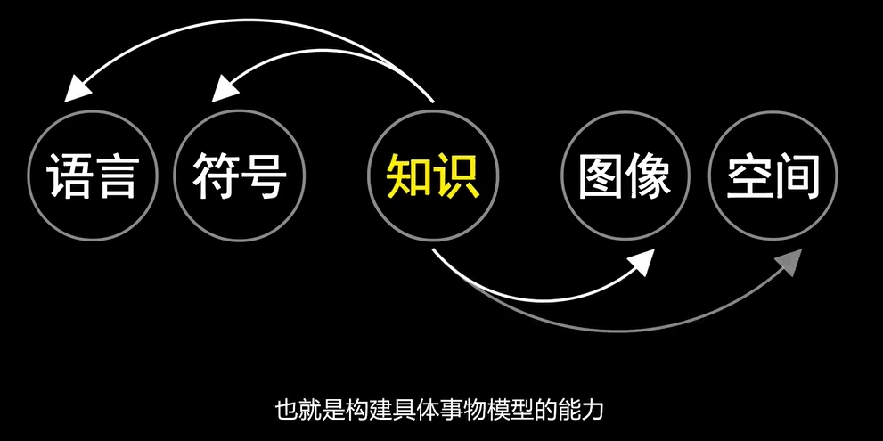
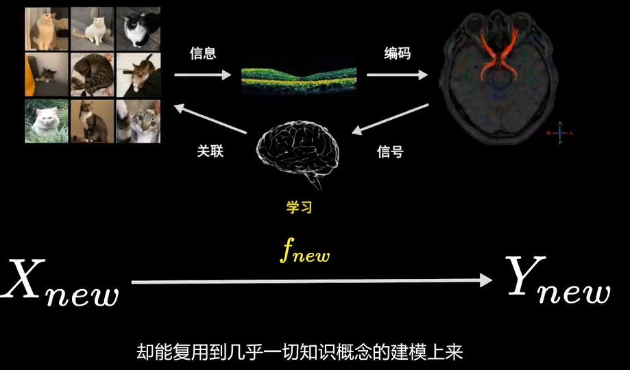
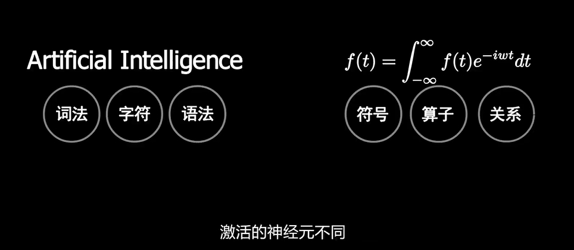

---
> **ARTS-week-04**
> 2024-01-27 21:53
---


## ARTS-2019 左耳听风社群活动--每周完成一个 ARTS
1.Algorithm: 每周至少做一个 leetcode 的算法题
2.Review: 阅读并点评至少一篇英文技术文章
3.Tip: 学习至少一个技术技巧
4.Share: 分享一篇有观点和思考的技术文章

### 1.Algorithm:

- [76. 最小覆盖子串](https://leetcode.cn/submissions/detail/497103664/)  
    + 思路：滑窗

### 2.Review:

[💊 学习如何编码的影响](https://dev.to/evergrowingdev/your-coding-skills-are-priceless-heres-why-1bj)  

#### 为什么学习编程可以塑造你的生活，创造更美好的财务未来。

想象一下：你坐在光线昏暗的卧室里，盯着电脑屏幕上的一行行神秘代码。你花了无数的时间修补这个数字难题，并决心破解它。然后，突然间，咔哒一声。该程序变得栩栩如生，响应你的命令并执行你从未想过的任务。那一刻，你意识到编码的真正力量。

凭借你现在拥有的技能，你有潜力改变你的财务生活，创造更美好的未来。

现在你可能认为获得编码技能的主要好处是它可以让你追求新的职业机会，我也有完全相同的想法。

当我第一次开始学习编码时，我唯一的最终目标是成为一名受雇的软件开发人员。我不认为除此之外还有什么，工作满意度是我的主要动力。

当快乐遇到工作时，那就是奇迹发生的时候，对吗？

职业道路的改变对我来说足以改变我的生活，这就是我当时所需要实现的一切。

但如果我告诉你你的技能比这更有价值呢？

你不仅需要成为一名软件工程师，甚至根本不需要成为一名软件工程师！凭借你所拥有的技能，你可以塑造你所能想象的任何未来。

你的编码技能是无价的。

学习编码不再只是技术爱好者的一项小众技能。它已成为转型的催化剂，为大量机会打开大门，并使个人能够掌控自己的职业和财务旅程。

你也可以掌控一切。

如果你具备编码技能，那么有很多方法可以使用它们，让你超越朝九晚五的生活。

去一个财务自由的地方。

以下是你需要了解的内容：

#### 你的技能有价值

在当今的数字环境中，编码技能的价值远远超出了当前工作场所的范围。在不断发展的技术驱动世界中，编写代码和开发软件解决方案的能力是令人垂涎的资产。

从初创公司到跨国公司，不同行业的组织都在寻找具有编程专业知识的人才来推动创新和应对复杂的挑战。

将你的编码技能视为你的秘密武器，很少有人拥有或知道如何正确使用。

此外，编码是解决问题和创造价值的强大工具。想想可以应用编程技能的无数种方式。你有潜力简化流程、自动化重复任务、增强用户体验并彻底改变整个行业！

##### 那么这是什么意思？

这意味着你的技能是无价的，朝九晚五的人永远无法真正补偿你的技能，所以如果你想真正改变你的生活，你需要利用它们来实现更大的利益。

构建解决现实问题的应用程序。如果你能为某人解决问题，他们很可能会付钱给你。

当你找到一种方法来为你的产品而不是你的时间获得报酬时，你会发现自己处于财务自由的全新水平。

想象一下未来，你的收入不再受你投入的时间限制，而是受你带来的价值限制。作为一名编码员，你有能力创建有潜力产生被动收入、经常性收入流，甚至扩展到成熟业务的产品。

永远不要低估你的技能的价值。

#### 你的技能就是你的个人资产

一旦你学会了如何编码，就该开始将自己视为不仅仅是一名员工了。你是一个商业实体，你的编码技能是你的宝贵资产。

拥抱这种心态开辟了一条隐藏的道路，可以扩大你的影响力，并在当前或未来雇主的范围之外推销你的技能。互联网已成为通往无限机遇的门户，是时候利用其力量为你带来优势了。

##### 那么我该怎么做呢？

建立个人品牌并释放新机会的最有效方法之一就是建立个人品牌。社交媒体平台为展示你的编码能力并与更广泛的受众建立联系提供了完美的舞台。

通过分享你的知识、见解和项目，你不仅可以展示你的技能，还可以在你的领域建立信誉。潜在客户可以轻松发现你的专业知识并询问你的服务。

在线发布内容不仅仅是为了自我推销；它是为他人创建有价值的资源并成为你所在领域值得信赖的权威。分享你的经验、见解和技巧不仅可以帮助其他人，还可以让你成为编码社区的重要人物。

通过一致且优质的内容打造个人品牌可以建立你的信誉，而信誉非常有价值。

#### 你可以多次出售你的技能

一旦你能够编码，你就拥有了可供多个客户使用的宝贵技能，但你很可能只会将其出售给单个雇主。

通过多次出售你的技能，你不仅可以增加收入，还可以减少对单一就业来源的依赖。

扩大你的客户群并使你的收入来源多样化可以带来显着的优势。超越你的主要工作，考虑可以利用你的编码技能赚钱的各种途径。

##### 那么我该怎么做呢？

咨询、教学、辅导，甚至创建在线课程都是利用你的专业知识并创造额外收入来源的可行选择。通过利用这些替代途径，你可以打开新机遇和增长可能性的大门。

摆脱单一雇主的限制可以让你充分发挥潜力，并为在经济上更加自力更生开辟道路。

只有当你能够扩大收入来源时，你的经济生活才会发生改变，因此，不要将你的能力限制在一个雇主的范围内。

相反，探索无数种可以多次推销你的技能并掌控你的职业旅程的方法。

#### 你的技能可以给你比你的雇主更多的报酬

如果你的编码技能可以给你比普通雇主提供的更多的薪水怎么办？

这听起来像是一个遥远的梦想，但只要有企业家的心态，它就可以成为现实。通过超越传统的就业界限进行思考，你可以发现独特且有利可图的方式来利用你的编码专业知识。

但我们还要解决一些经常阻碍有抱负的企业家的问题：对竞业禁止协议的恐惧。

你可能听说过人们因与多个雇主或客户合作而被起诉或面临法律后果的恐怖故事。当面对违反此类协议的想法时，我们很自然会感到犹豫，但区分事实和虚构是至关重要的。

首先，竞业禁止协议并非普遍可执行。它们的范围和可执行性有所不同，具体取决于你所在的位置以及协议中概述的具体条款。虽然有些公司可能有严格的条款，但许多竞业禁止协议实际上很难执行或存在保护你权利的限制。

##### 那么接下来会发生什么呢？

应该没有什么可以阻止你利用多种收入来源。

你不应再受到单一雇主的限制的约束。你成为自己这艘船的船长，引导你的职业生涯朝着符合你的目标和愿望的方向发展。

有几种方法可以实现这一目标：

1.构建自定义解决方案- 作为熟练的编码员，你有能力为客户或企业创建量身定制的解决方案。这可能涉及开发专门的软件、自动化复杂的流程或设计定制网站。通过提供解决特定痛点的个性化解决方案，你可以获得更高的费率并为客户提供显着的价值。

2.开发插件或扩展- 许多软件平台和内容管理系统依赖第三方插件或扩展来增强其功能。通过开发和销售你自己的插件或扩展，你可以进入利润丰厚的市场。这些附加组件可以解决特定问题、改善用户体验或添加新功能，为愿意付费的个人和企业提供有价值的服务。

3.提供技术培训和支持- 凭借你的编码专业知识，你可以为寻求提高技能或解决技术问题的个人或组织提供培训和支持服务。这可能涉及举办研讨会、提供一对一辅导或创建在线教程。通过分享你的知识并帮助其他人应对编码的复杂性，你可以将自己定位为专家并为你的服务收取额外费用。

4.创建数字资产- 超越传统的客户工作，考虑创建和销售满足更广泛受众的数字资产。这可能包括开发和销售网站、应用程序或图形设计项目的模板、主题或设计资产。通过创建高质量的数字资产，为业内其他专业人士节省时间和精力，你可以产生被动收入并增加你的收入潜力。

#### 结论

如果你还没有意识到你的编码技能有多么有价值，那么现在是时候重新评估你可以实现的目标了。

当你牢记你的编码技能更有价值，远远超出当前雇主的范围时，你就为更美好的财务未来打开了空间。

请记住，你并不局限于单一的工作或雇主——你可以自由地使你的收入来源多样化，并创造自己的企业家道路。

通过在线销售你的编码技能、建立个人品牌以及与他人建立联系的隐藏路径，你可以吸引新客户并打开无限可能性的大门。互联网为你提供了一个展示技能、建立信誉并与认可你带来的价值的潜在客户或投资者建立联系的平台。

因此，不要认为你的编码技能只能达到一个目的。

你的时间是宝贵的，你的技能是无价的。

### 3.Tip:

#### 唯一索引（unique index）的创建和使用

以下是在postgresql数据库上进行测试

如果在一个列上同时建唯一索引和普通索引的话，mysql会自动选择唯一索引。

1创建唯一索引

```sql
-- 创建唯一索引
CREATE UNIQUE INDEX uk_users_name ON t_users(name); 
```
uk_users_name：自由定义的唯一索引名称
t_users：表格名称
name：字段名称

注意：唯一索引对null不起作用，也就是字段为null的话可以重复；
注意：唯一索引对" “不起作用，也就是字段为” "的话不可以重复；

2删除唯一索引

```sql
-- 删除唯一索引
drop index uk_users_name;
```

添加 if EXISTS，语句可重复执行不报错；

```sql
-- 删除唯一索引
drop index if EXISTS uk_users_name;
```

3 创建、删除唯一键约束
使用约束CONSTRAINT 创建不重复索引；和唯一索引效果一样；

```sql
-- 创建唯一键约束
ALTER TABLE t_users ADD CONSTRAINT uk_users_name1 UNIQUE (NAME);
-- 删除唯一键约束
alter table t_users drop constraint if EXISTS uk_users_name1;
```

#### 举一反三
思考：【思维论09】如何成为一个很厉害的人？这个视频将会改变你的一生
什么是学习
狭义学习->广义学习  不仅仅是应付考试，还包括对世间万物的理解和应用能力
能力获取：进化而来的先天结构、学习探索的后天结构
构建具体事物模型的能力




元学习 信息→编码→信号→关联


任务采样 数据采样
能力迁移到不同的任务


1.认知
2.刻意练习 
减少重复输入 在可记忆区间内尽可能捕捉实体间的知识共性与任务共性
举一反三 一种对问题共性和特性捕捉的能力

### 4.Share:

[超给力 Vue.js 可视化H5拖拽编辑器Quark-H5](https://www.cnblogs.com/yehuisir/p/13533213.html) 