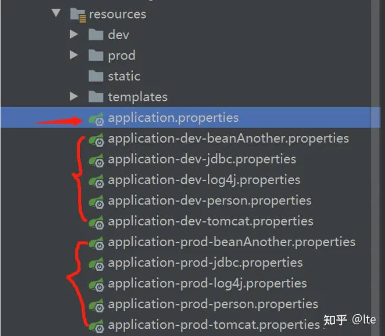
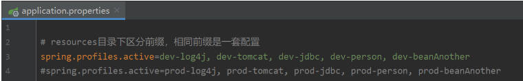
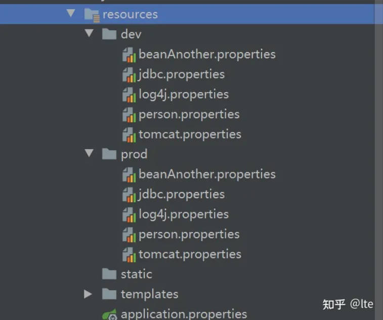

---
> **ARTS-week-06**
> 2024-02-16 10:05
---


## ARTS-2019 左耳听风社群活动--每周完成一个 ARTS
1.Algorithm: 每周至少做一个 leetcode 的算法题
2.Review: 阅读并点评至少一篇英文技术文章
3.Tip: 学习至少一个技术技巧
4.Share: 分享一篇有观点和思考的技术文章

### 1.Algorithm:

- [438. 找到字符串中所有字母异位词](https://leetcode.cn/submissions/detail/502300799/)  
    + 思路：滑窗

### 2.Review:

[🧊 困在代码上？以下是如何解锁自己](https://dev.to/evergrowingdev/stuck-on-code-heres-how-to-unblock-yourself-3bo9)  

#### 当你在编码时遇到困难时该怎么做的实用技巧。
如果在任何程序员的旅程中有一件事是可以保证的，那就是你会陷入困境。

没有办法避免它。

没有一个开发人员没有在某个时候被编码问题困扰过。

解决问题是游戏的目标，是工作描述的一部分，也是我们最擅长的。

如果你正在学习编码，那么陷入困境并克服这些问题对于成为一名成功的开发人员起着重要作用。

```
今天解决的问题明天的问题就会减半。
```

陷入困境并不意味着你很愚蠢，或者你不适合编程。解决方案总是有的，但挑战在于如何以及在哪里找到它。

由于你可能会遇到如此多的错误和错误，我不可能单独描述如何解决每个问题。

但我能做的就是给你一些提示，告诉你如何在任何问题下解除对自己的封锁。

在本文中，我们将介绍一些解锁自己的技巧，并了解遇到困难时该怎么做。

因此，在你开始恐慌或沮丧之前，请先尝试以下操作：

##### 1）拥抱问题🤗
如果你面临编码挑战，很容易就会产生不知所措或恼怒的感觉。

然而，作为一名程序员，解除自己障碍的第一步是接受问题并将其视为宝贵的学习经历。

它需要思维方式的转变，你不再将每个挑战视为障碍，而是视为成长和掌握的垫脚石。

采取成长心态是关键。

不要将挑战视为巨大的障碍，而应将其视为个人和职业发展的机会。

了解每个错误、每个错误消息和每个障碍都有一个值得学习的教训。

通过以成长心态应对编码挑战，你可以迎接新的可能性，并让自己能够解决最复杂的问题。

一旦你的想法正确并解决了你的想法，你就会发现自己更愿意寻求解决方案。

##### 2）分解它🔨
所以现在你知道你遇到了问题，你已经接受了问题的本质，现在你准备好找到解决问题的方法了。

无论问题有多大或多小，最好尝试看看如何将其分解为更小、更易于管理的部分。

这种方法不仅可以简化当前的问题，还可以更轻松地解决你的问题。

要有效地分解问题，首先要分析问题。例如，如果代码中存在错误，请确定所涉及的关键组件或功能。

然后，考虑实现预期结果所需的逻辑步骤。考虑输入和输出。对自己说，如果我输入 X，那么我希望我的代码输出 Y。如果输出不是你所期望的，那么你可以尝试确定是什么阻止了它工作。

好的做法是尝试以结构化方式组织代码，将代码划分为更小的函数或模块。

这样你就可以封装特定的功能并使它们更易于管理。

随着时间的推移，这种模块化方法可以更轻松地进行调试、维护和代码重用。

##### 3）尝试调试它🕵️
在编程中，你可能遇到的最常见问题是错误。

就像自然界一样，虫子可能具有侵入性且令人烦恼。

你可以使用多种调试技术来尝试帮助你找到问题的解决方案。

我们来看看几个关键的：

1. 打印日志

这涉及到在代码中策略性地放置打印语句（或控制台日志）。通过在关键点插入打印语句，可以输出变量值、执行流程和其他相关信息。

这样可以实时洞察程序的行为，并有助于识别有问题的区域。

例如，当遇到函数的意外输出时，在不同阶段插入打印语句可以提供对变量值的可见性并帮助查明问题的根源。

2. 调试工具

集成开发环境 (IDE)、代码编辑器和其他开发工具提供高级调试功能，可提高调试过程的效率和准确性。

这些工具提供断点、逐步执行和变量检查等功能，使你能够仔细检查代码执行并在粒度级别诊断问题。

例如，当遇到难以重现的运行时错误时，在可疑的代码行设置断点将允许你暂停执行、检查变量值并分析程序的状态。

通过单步执行代码，你可以确定错误发生的精确位置。

3. 错误处理

当代码缺乏错误处理时，遇到错误时很容易崩溃。但是，通过适当的错误处理，可以在错误破坏应用程序之前拦截错误。

然后处理错误，例如通过记录日志或将其存储在数据库中，从而使应用程序能够继续顺利运行。

这对于识别生产环境中的错误特别有效。通过在发生错误时收集错误，你可以稍后对其进行分析，以确定导致错误的潜在错误。

4. 注释掉代码

一种简单但有用的调试方法是“注释掉”代码部分。

通过将功能代码转换为注释，这些行将变为非活动状态并且不会被执行。该过程首先注释掉应用程序中怀疑存在问题的特定部分中的代码。逐渐地，每次重新引入每一行代码，然后你可以监视错误的再次出现。

这种技术允许你隔离有问题的代码部分，逐行检查它，并希望确定错误发生的位置。

调试需要一段时间来练习和掌握，但随着时间的推移，你将能够快速使用和组合所有这些技术，这将帮助你更快地解决问题。


##### 4) 尝试橡皮鸭调试🐥
把你的问题告诉橡皮鸭🦆。

不，这不是玩笑，我也没有骗你。

橡皮鸭调试是一种非常规但非常有效的问题解决技术。

橡皮鸭调试背后的原理源于这样一种想法：用语言表达问题迫使你从不同的角度阐明和检查它。

向无生命的物体（例如橡皮鸭）解释代码问题的概念可以在解码复杂问题时产生奇迹。

通过向细心的橡皮鸭听众逐步解释代码，你实际上是在大声谈论问题。

这个过程有助于组织你的想法，强调假设，并找出你理解中的差距。然后，你可能会发现自己自然地仔细检查每行代码背后的逻辑。

橡皮鸭调试提供了一个全新的视角，并为开发人员提供了一个非评判性的参谋。

自言自语（或橡皮鸭）并不可耻。

##### 5）阅读文档📖
这听起来似乎是显而易见的，但你会惊讶地发现，你很容易忘记大多数编程语言、框架和库都有官方文档来帮助你提供支持。

这些文档可能看起来冗长而深入，但这就是重点。

它们旨在让你深入了解事物如何工作、如何使用某些方法、组件或代码块等。它们甚至可能包含故障排除信息。

现在我们甚至有许多社区贡献的文档，人们在其中添加了更多信息来支持官方文档。

很多时候，你所面临的问题很可能已被捕获并写在某个地方。

此外，通过阅读文档，你还可能发现使代码更健壮且不易出现错误的技术。

有时，最简单的问题之所以能得到解决，仅仅是因为我们没有正确实施或使用某些东西。文档是帮助解决此问题的有用方法。

一个好的提示是，如果你在代码中使用了你不熟悉的某些内容，请首先彻底阅读有关它的文档。

这样你就可以避免犯一些简单的错误，这些错误后来会变成令人沮丧的大问题。

##### 6）寻求在线帮助🔍
我上面提到的许多技术可能已经涉及到这样做，但我认为强调你将可以访问的最大的解决问题的工具 - 互联网仍然很重要。

大多数开发人员经常开玩笑说他们 80% 的时间都花在了谷歌搜索上，这是有原因的。

这只是因为谷歌和网络世界的其他地方是寻找编程问题解决方案的最全面的地方。

如果你有错误消息，你所要做的就是用谷歌搜索，你很可能会找到其他人写的信息。

在线社区，例如编程论坛（如StackOverflow）、开发人员社区（如Dev.to和Hashnode）以及开源项目空间（如GitHub），为寻求帮助和与其他开发人员互动提供了绝佳的平台。

这些社区充满了热情的程序员，他们渴望分享知识、提供指导并在项目上进行协作。

通过积极参与这些社区，你不仅可以获得丰富的专业知识，还可以建立一个支持性同伴网络，他们可以在充满挑战的时期提供鼓励和动力。

##### 7）退一步🚶‍♂️
如果你已经尝试了上述所有方法，但仍然陷入困境或感到沮丧，那么是时候退后一步了。

有时，我们过于专注于让某件事发挥作用，以至于忘记了时间和自己。

在我们寻求解决问题或调试代码的过程中，我们会进入隧道视野模式，这实际上会阻碍我们的思维过程和能力。

如果你已经在某个问题上花费了大量时间，那么最好的做法是暂时离开代码并让自己获得一些新的视角。

离开屏幕并将注意力转移到其他活动上可以对解决问题产生显着的效果。

休息的主要好处之一是让你的大脑有机会放松和重置。

进行与编码无关的活动可以帮助你摆脱手头的问题，并让你的大脑有机会下意识地处理信息。

这种精神上的休息常常会在你最意想不到的时候带来突破和“顿悟”时刻。

我无法告诉你有多少次我在漫不经心地度过一天并分散自己的注意力而无法专注于自己的问题时找到了错误的解决方案。

离开并不意味着放弃，它意味着你让自己的大脑和眼睛得到了应有的休息，这样你回来时就会比以往更加充满活力和力量！

#### 结论
总而言之，正如我们所认识到的，陷入困境不是“是否”的问题，而是“何时”的问题。

采用成长心态并将挫折视为宝贵的经验，可以让你将挫折转化为动力。

将复杂的问题分解为可管理的部分可以增强故障排除和解决问题的能力。

打印语句、日志记录、调试工具、错误处理、代码注释等实用的调试技术可以帮助你高效地识别和解决问题，确保代码运行顺利。

探索橡皮鸭调试的概念，向橡皮鸭这样的无生命对象解释代码问题可以带来清晰度并揭示解决方案，开辟新的视角。

阅读文档和在线资源可以从主要来源和其他来源获取丰富的专业知识和替代方法。

因此，下次你陷入困境时，请记住这不会是最后一次，但希望这些步骤可以帮助你度过难关，并为你扫清通往胜利的道路！


### 3.Tip:

#### springboot多属性文件多环境配置

一、springboot是支持properties和yml这两种文件的，我们以propertiers文件为例来说明如何实现多环境多属性文件的配置方案

二、需求是：拆分properties文件，根据不同技术模块需要不同属性文件，比如：
jdbc：application-jdbc.properties
redis：application-redis.properties
tomcat：application-tomcat.properties
把jdbc、redis、tomcat这3个模块的属性配置文件分开，让整个目录层次清晰，修改方便
同时支持开发环境和线上环境是不同属性文件

针对这个需求，有2种实现方案，

第一：工程的resources目录下创建6个文件：
application-dev-jdbc.properties
application-dev-redis.properties
application-dev-tomcat.properties

application-prod-jdbc.properties
application-prod-redis.properties
application-prod-tomcat.properties

dev=开发环境、prod=线上环境，如图1所示：


application.properties 这个文件需保留，是springboot工程默认会加载的属性文件，所以在这个文件中，就可以设置一个属性，就可以把这些子属性文件都包含进来读取：
# resources目录下区分前缀，相同前缀是一套配置
spring.profiles.active=dev-log4j, dev-tomcat, dev-jdbc, dev-redis, dev-beanAnother
如图2所示：


最重要的就是：application 后面跟上一个特定的名称，把这些特定名称，都加到这个属性上

这种方案：适合把 tomcat 配置、jdbc 配置、redis 配置，等等，都可以分门别类的整理到一个个属性文件中，
实体类还是使用2个注解，就可以完成属性值装入：
@Component
@ConfigurationProperties(prefix = "redis")//实现批量注入（set方法）

第二：工程的resources目录下创建2个目录：
dev
prod
这样2个目录，如图3所示：


在这2个目录下，分别去编写 jdbc.properties，redis.properties，tomcat.properties文件，
注意：springboot 默认带的组件，比如tomcat、就可能在第一时间启动读取不到这个tomcat.properties文件，但是自己写的实体类，或者jdbc之类的数据源，自定义出对象的，都可以在此编写对于的属性文件。

如何使用呢？

1、application.properties 这个属性文件的这个key应该设置为：
spring.profiles.active=dev，需要什么环境，去设置什么值，如图4所示：


2、这个配置编写好之后，就是具体的使用中，需要用到 @PropertySource注解来说明具体使用哪个环境下的文件，如图5所示：


主要就是靠 application.properties 中的 spring.profiles.active 的值来决定是哪个目录

方案二 非常适合自定义类 需要自定义属性值的装入

总的来说，看项目需求，可以2个方式结合来用：
1、springboot基础环境的配置，走方案一
2、自定义实体类，需要属性灵动赋值，走方案二
两者要结合使用，对这个 dev、prod命名就有讲究，
假如命名为 dev_common，那么application属性文件就需要命名为：application-dev_common.properties
同时resources文件夹下的目录也命名为：dev_common，到时候用 @PropertySource注解就不会出错。

yml文件的方式处理方案相同。

#### 举一反三
【思维论03】费曼学习法的误区：为什么学渣给学霸讲题，学习收益才更高？

费曼学习法
一.流程：获取——教学——评价——简化

二.为什么有效？
1.输入式的被动学习，我们不知道所欠缺的是什么。
2.输出式的主动学习，我们才会发现哪里有问题。

三.原因与现象：
1.老师讲题所运用的是记忆功能，思维处于单一路径。
2.自己做题所运用的是归纳推理功能，思维处于未知路径。
3.一讲就会，一做就废。

四.误区与方法：
1.我们扮演老师给其他人讲题这个步骤没有错，但其他人没有懂，就不能给你评价反馈。
2.先由下而上：“能不能听我讲讲这道题，并给我一些建议”，再由上而下：给其他人讲解简化加之自己的理解的方法。
简单来说：学霸反馈知识缺陷，学渣重构知识脉络。
最后记得用心讲解！

### 4.Share:

[Java - Metaspace vs PermGen space](https://www.javainuse.com/java/metaspace)

[老K的Java博客-Metaspace元空间Gc垃圾回收问题](https://javakk.com/378.html)

[由「Metaspace容量不足触发CMS GC」从而引发的思考](https://zhuanlan.zhihu.com/p/269860788)

[Metaspace泄漏排查](https://juejin.cn/post/6844903629309083656)