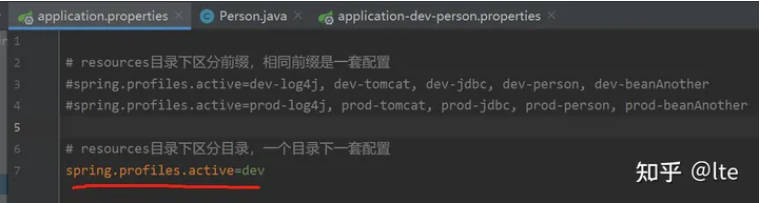

---
> **ARTS-week-07**
> 2024-02-24 09:22
---


## ARTS-2019 左耳听风社群活动--每周完成一个 ARTS
1.Algorithm: 每周至少做一个 leetcode 的算法题
2.Review: 阅读并点评至少一篇英文技术文章
3.Tip: 学习至少一个技术技巧
4.Share: 分享一篇有观点和思考的技术文章

### 1.Algorithm:

- [567. 字符串的排列](https://leetcode.cn/submissions/detail/504289921/)  
    + 思路：滑窗

### 2.Review:

[👷 如何构建人们想要使用的应用](https://dev.to/evergrowingdev/how-to-build-things-people-want-to-use-4g5n)  

#### 为什么用户体验在编程中很重要
如果我们把思绪拉回到 90 年代（如果你足够老😅的话），我们可以记住网站看起来与今天的样子大不相同。

当时，互联网正在发展，并作为获取信息的地方得到更广泛的使用和流行。

外观和感觉与任何事情都没有太大关系，只要我们能找到我们需要的东西。

如果我们暂时抛开技术不如今天的事实，那么想想任何人实际上是如何设法使用某些网站的，这真是令人震惊。

例如，如果我们快速浏览一下雅虎 90 年代的网站，人们现在可能会看着它并思考，这到底是怎么回事？


90年代雅虎网站

随着时间的流逝，这正是用户需要回答的问题。

我们使用网站的次数越多，我们对它们的要求就越高。

如果网站太慢或难以浏览，我们只需跳过它并继续前进。

就在那时，公司和网站制作者发现了最重要的事情-用户体验

#### 用户体验及其重要性
自 90 年代以来，互联网上现在有数十亿个网站和数百万个软件应用程序。

当网站和应用程序像海滩上的沙粒一样丰富时，在人群中脱颖而出不再只是你的网站或应用程序可以做什么。

这是关于它给人们带来的感受。

这是关于创造一些不仅实用，而且直观、引人入胜，是的，甚至有点乐趣的东西。

如果我们现在看一下雅虎的网站，我们可以看到一个很大的不同：


我们可以确切地知道提供哪些内容。我们可以看到引人注目的图像，一切都被很好地分类。

现在它可能不是世界上最好的网站，但我的观点并不是要深入研究雅虎的优缺点，这只是一个网站的快速示例，该网站必须随着时间的推移进行自我调整以满足用户的需求，这样他们就不会失去他们。

用户体验（或UX）与任何单一的交互或设计元素无关。相反，它是用户与产品、系统或服务的交互的总和。

现在，如果你在想，

```
这一切都很好，但我是一名程序员。我为什么要关心用户体验？
```

嗯，这有点像厨师问他们为什么要关心食物的味道。

就像厨师可以做最奢侈的饭菜，但如果它的味道很糟糕，那么没有人会想回到餐厅，你可以写出最有效、最无错误的代码，但如果最终产品没有引起用户的共鸣，它就不太可能成为赢家。

对用户体验的关注不仅是锦上添花，而且是必须的。

这就是我们离不开的应用程序与我们在一次使用后卸载的应用程序之间的区别。

这就是使网站成为浏览乐趣而不是苦差事的原因。

它使用户成为忠实的客户，并使你的软件与平庸软件区分开来。

#### 用户体验和编程
如果你是编码新手或学习如何编码，你可能会想，

```
我想成为一名程序员，而不是设计师。我为什么要担心用户体验？
```

现在我喜欢这个问题，因为在我成为开发人员之前，我自己是一名 UI/UX 设计师很多年，我喜欢这样想：

想象一下，你是一个建造房屋的建筑商。你不会只关注实体店，对吧？

你还会考虑房间如何流动在一起，窗户应该在哪里获得最佳光线，以及如何为住在那里的人提供舒适和实用的空间。

否则，你最终可能会在屋顶上安装门，因为它看起来很酷，那为什么不呢？

撇开玩笑不谈，在构建项目时拥有更全面的思考是UX带给编程的。

那么，作为程序员，你如何在编码时牢记用户体验原则呢？
它始于同理心。试着设身处地为用户着想。

请考虑以下几点：

1.谁将使用你的软件或网站？

2.他们将用它来做什么？

3.他们的需求和目标是什么？

4.他们试图解决什么问题？

5.你的软件如何让他们的生活更轻松或更美好？

接下来，考虑用户旅程：

1.用户将如何浏览你的软件或网站？

2.他们将采取哪些步骤来完成任务？

3.你如何才能使这段旅程尽可能顺利和直观？

这可能涉及创建清晰、易于遵循的导航、提供有用的错误消息或确保你的软件快速响应用户输入。

最后，请记住，用户体验是一个持续的过程。

这不是你做过一次然后就忘记的事情。它涉及不断与真实用户一起测试你的软件或网站、收集反馈并进行改进。

这个迭代过程可以导致

#### 将 UX 添加到开发流程中
很好，现在我们知道了UX在编程中的重要性，让我们看看如何将其实际添加到软件开发过程中。

以下是一些需要考虑的事项：

##### 用户研究
你可以开始的第一件事是用户研究。

这是你扮演侦探并进入用户心智的机会。

如前所述，你需要了解他们的需求、痛点和目标是什么。

用户研究可以采取多种形式，从调查和访谈到观察和用户测试。

目标是收集尽可能多的信息，为你的设计决策提供信息。

如果你找不到任何潜在的用户，也许只是试着询问你的朋友和家人的意见，或者在论坛上提问。

你可以事先收集的任何形式的信息都可以帮助你走上一条为用户创造最佳体验的良好道路。

如果用户只是你，那完全没问题，在你开始之前，仍然绝对值得回答你自己的问题。

##### 原型设计
接下来，我们进行原型设计。

这是你开始把你的想法变为现实的地方。原型是你的软件或网站的初步模型，允许你测试你的设计概念并从用户那里获得反馈。

这就像一个粗略的草图，让你有机会在开始真正充实它之前对其进行调整。

原型可以有多种形式，我不会详细介绍，但是这篇关于 Geeks for Geeks 的文章很好地解释了这一点。

根据你所构建的内容，将取决于你想用你的原型去的远或大。

但是，总体思路是能够始终如一地从用户那里获得反馈，以便随着时间的推移改进解决方案。

##### 可用性测试
这就把我们带到了可用性测试。

这涉及将你的原型呈现在真实用户面前，并在他们使用时观察他们。

这就像是对你的解决方案的口味测试。你正在寻找可能影响用户体验的任何问题，例如令人困惑的导航或不清楚的说明。

你从可用性测试中获得的反馈对于改进你的设计非常宝贵。

如果你像我们许多人经常做的那样，独自工作，那么我们经常会发现我们可能不会像用户那样使用我们的产品。

毕竟，我们一直在看它，所以我们已经知道一切在哪里。

允许用户测试和使用它可以产生有趣和令人惊讶的结果。

突然之间，我们认为很明显的东西很容易被用户错过。

因此，我们永远不能假设什么有效，什么无效。

##### 迭代设计
最后，我们有迭代设计。

这是根据用户反馈不断测试和完善软件的过程。

仅仅做一次你的东西并收工是不够的。

你需要不断调整、测试和改进，直到拥有用户喜爱的产品。

回到雅虎，如果你回顾从90年代到现在的几十年，你会看到他们多年来的各种不同的设计和布局，这是有原因的。

这是因为他们会始终如一地收集用户的反馈，并运行 A/B 测试等内容来真正了解用户的需求。

如果版本一不是最终版本也没关系。

唯一重要的版本是人们真正想要使用的版本。

#### UX 工具和资源
现在我没有忘记我们是开发人员而不是设计师，但是，你可能会发现获得更深入的整体用户体验知识很有用。

如果有兴趣，有很多资源可以开始，以及可用于项目的工具：

书:
Don't Make Me Think - by Steve Krug
The Design of Everyday Things - by Don Norman
Lean UX - by Jeff Gothelf and Josh Seiden

博客:
Nielsen Norman Group
UX Magazine
Smashing Magazine's UX Design Category

播客:
UX Podcast
User Defenders

UX 设计和原型工具:
Figma
Framer
Wireframe.cc
Justinmind

在线社区和论坛:
UX Stack Exchange
UX Mastery Community
UX Design Subreddit

测试和分析工具:
Lookback
UsabilityHub
Userbrain

#### 结论
总而言之，成为一名优秀开发人员的一部分旅程是学习如何构建人们想要使用的东西。

但是，当然，这种技能会随着时间的推移而出现，所以在这个过程中，至少首先开始考虑用户永远不会太早。

请记住，用户体验的核心是同理心--了解你的用户、他们的需求、他们的挫折和他们的目标，将使你走上正确的道路。

在编码时，请尽量牢记用户。

毕竟，随着我们的成长，我们不仅仅是为了建造东西而建造东西。

我们正在构建一些东西来解决问题，使任务更容易，并为人们的生活带来一点快乐。

### 3.Tip:

#### springboot 中 @Cacheable 不起作用

一、application.properties中记得启用缓存 spring.cache.type=redis

二、缓存的对象必须实现 Serializable

三、SpringBootApplication 中要加 @EnableCaching 注解

四、@Cacheable 是基于 Spring AOP 代理类，内部方法调用是不走代理的，@Cacheable 是不起作用的

# resources目录下区分前缀，相同前缀是一套配置
spring.profiles.active=dev-log4j, dev-tomcat, dev-jdbc, dev-redis, dev-beanAnother
如图2所示：


最重要的就是：application 后面跟上一个特定的名称，把这些特定名称，都加到这个属性上

这种方案：适合把 tomcat 配置、jdbc 配置、redis 配置，等等，都可以分门别类的整理到一个个属性文件中，
实体类还是使用2个注解，就可以完成属性值装入：
@Component
@ConfigurationProperties(prefix = "redis")//实现批量注入（set方法）

第二：工程的resources目录下创建2个目录：
dev
prod
这样2个目录，如图3所示：


在这2个目录下，分别去编写 jdbc.properties，redis.properties，tomcat.properties文件，
注意：springboot 默认带的组件，比如tomcat、就可能在第一时间启动读取不到这个tomcat.properties文件，但是自己写的实体类，或者jdbc之类的数据源，自定义出对象的，都可以在此编写对于的属性文件。

如何使用呢？

1、application.properties 这个属性文件的这个key应该设置为：
spring.profiles.active=dev，需要什么环境，去设置什么值，如图4所示：


2、这个配置编写好之后，就是具体的使用中，需要用到 @PropertySource注解来说明具体使用哪个环境下的文件，如图5所示：


主要就是靠 application.properties 中的 spring.profiles.active 的值来决定是哪个目录

方案二 非常适合自定义类 需要自定义属性值的装入

总的来说，看项目需求，可以2个方式结合来用：
1、springboot基础环境的配置，走方案一
2、自定义实体类，需要属性灵动赋值，走方案二
两者要结合使用，对这个 dev、prod命名就有讲究，
假如命名为 dev_common，那么application属性文件就需要命名为：application-dev_common.properties
同时resources文件夹下的目录也命名为：dev_common，到时候用 @PropertySource注解就不会出错。

yml文件的方式处理方案相同。

#### 举一反三
【思维论11】你真的了解拖延症吗？4个方法，和拖延说不
①我们为什么会拖延
懒与拖延症的因果关系：拖延症只是懒的表象，却不是由懒引起的拖延
拖延症的两种原因：害怕做、没有动力做（害怕型拖延 【思维论09】如何成为一个很厉害的人？这个视频将会改变你的一生）
无动力型拖延：外在表现为懒，但懒不等于失败
不要将拖延症病态化，不要听信贩卖焦虑的视频
不要因为拖延症对自己失望、懊悔，接纳拖延症是自己思维的一部分这一事实，并试着认识和调整它
②四个调整思维的方法
a.安全阈值 03:46（循序渐进才是思维进化的终极法则）
拖延的时间不能超过某个阈值，阈值之内可以放下一切愧疚，心安理得地拖延，然后逐渐试着缩小安全区，一直小到拖延症几乎不会影响你的学习和生活
b.拒绝许可 04:18
自我许可实验（思维论第六期 【思维论06】彻底戒掉手机 | 专注学习的10个终极思维方法）
不要对自己有任何未来的期许，基于安全区的阈值进行行为规划。如果当下真的不想做，那么最好将期许日期量化
c.反馈回路 04:59
番茄工作法（思维论第四期 【思维论04】如何让自己像刷B站/抖音一样沉迷于学习？）
所谓反馈回路就是每当你完成一件事情，大脑就会获得某些反馈，比如多巴胺、血清素
反馈越强烈，行为模式的延迟就越低，就越不会拖延
我们的大脑知道的是完不成任务的负反馈，负反馈只会增强焦虑，弱化动力
解决发法就是增强正反馈信号（反馈回路机制 思维论第一期 【思维论01】如何让自己像打王者荣耀一样发了疯的学习？ 和第四期 【思维论04】如何让自己像刷B站/抖音一样沉迷于学习？）
d.改变环境 06:48
我们的思维分为长时思维和短时思维，大多数时候由短时思维所主导，只能看到某个范围内的东西
想戒掉拖延，先改变身边的环境，降低注意力被分散的风险（断网看书、用mp3听歌等）

### 4.Share:

[mybatis - PerpetualCache 一级缓存](https://blog.csdn.net/u013887008/article/details/120459596)

[SpringBoot缓存注解@Cacheable、@CacheEvict、@CachePut详解](https://blog.csdn.net/fuu123f/article/details/103563652)