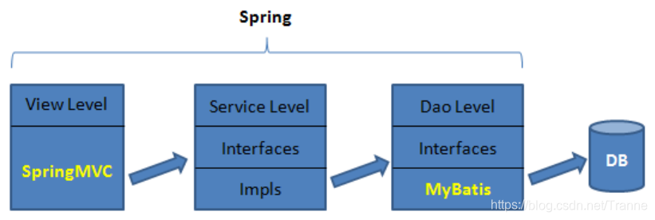

---
> **ARTS-week-08**
> 2024-02-24 10:41
---

## ARTS-2019 左耳听风社群活动--每周完成一个 ARTS
1.Algorithm: 每周至少做一个 leetcode 的算法题
2.Review: 阅读并点评至少一篇英文技术文章
3.Tip: 学习至少一个技术技巧
4.Share: 分享一篇有观点和思考的技术文章

### 1.Algorithm:

- [424. 替换后的最长重复字符](https://leetcode.cn/submissions/detail/504317224/)  
    + 思路：滑窗

### 2.Review:

[🌎 编程能拯救地球吗？](https://dev.to/evergrowingdev/can-programming-save-the-planet-4ldj)  

#### 可持续编码指南
人类正在扼杀我们的星球。

我们经常听到这样的声音。对于我们大多数人来说，我们明白可以做一些事情来更加环保。

我们听说过回收利用、使用绿色能源和更可持续地生活等事情，但你听说过可持续编码吗？

是的，没错，可持续编码是一回事。

作为新手开发人员或正在学习编码的人，你可能不一定考虑你编写的代码对环境有什么影响。

哎呀，我甚至可以说，这不是许多有经验的开发人员（包括我自己直到最近才想到的）。

如果我们开始考虑我们构建的所有软件和应用程序，那么它们的核心就是数据中心。

数据中心是庞大而耗电的综合体，拥有数千台服务器，为我们的在线生活提供动力，从社交媒体到银行再到医疗保健。

截至目前，这些数据中心消耗了全球1%的电力，而且随着我们对数字服务的日益依赖，这一数字将会上升。

虽然乍一看这似乎并不多，但考虑到全球发电量约占所有温室气体排放量的四分之一，但你开始掌握问题的规模——这非常令人震惊！

那么，我们能做些什么呢？

好吧，一个答案在于可持续编码。

#### 什么是可持续编码？
可持续编码，也称为绿色编码，是最近由各种组织推广的一个术语，旨在解决其对环境的影响。

这是一个全新的、以环境为重点的编程视角，旨在减轻我们数字活动的碳足迹。

它的核心是创建不仅实用而且节能的代码，允许计算机算法以尽可能少的能源运行。

此概念涉及两种主要类型的注意事项：

- 结构
结构注意事项是指与代码块本身相关的能源指标。

- 行为
行为注意事项，重点关注与特定用户方案相关的能源使用情况，例如滚动浏览社交媒体源或发送电子邮件。

绿色编码不需要对现有的编码实践进行彻底的改造（所以没有必要重构你所有的项目！），而是需要重新思考节能设计。

设备必须处理的每一行代码都会增加其整体碳排放量，因此目的是在不牺牲功能的情况下最大限度地减少代码量。

它更多的是关于接受精益编码原则。

绿色编码侧重于使用最少的处理能力来实现所需的结果。

这可能包括优化高质量的媒体文件以使其更小或降低屏幕图像分辨率，所有这些都可以加快加载时间、改善用户体验，以及至关重要的能耗降低。

#### 可持续编码的好处
在研究可持续编码的长期利益时，我们很快意识到绿色编码远远超出了个人编码实践的范围。

认识到这一点，亚马逊和谷歌等科技巨头在采用可再生能源开展业务方面取得了长足的进步。

例如，亚马逊网络服务（AWS）已承诺到2025年使用100%可再生能源为其所有业务提供动力。谷歌紧随其后，实现了到2030年运营无碳数据中心的目标。

那么他们为什么要这样做呢？

让我们来看看采用可持续编码实践的一些长期好处：

- 降低能耗
可持续的编码实践有助于减少数据中心的能源消耗量，从而减少碳排放。

- 提高效率
通过优先考虑精益代码，这些实践使软件应用程序更加高效，使用更少的资源来交付相同的结果。

- 更好的用户体验
更快的加载时间和优化的高质量媒体可改善用户体验。

- 增强的搜索引擎优化
节能网站在搜索引擎排名中表现更好，提高知名度并增加自然流量。

- 节省成本
通过减少能源使用和简化编码流程，公司可以节省运营和管理成本。

- 可持续的未来
这些实践在确保数字世界和整个地球的可持续未来方面发挥着至关重要的作用。

简而言之，可持续编码代表了向更具环保意识的软件开发方法的关键转变，从长远来看，这将帮助公司和企业在保护地球的同时进行数字化转型。

#### 可持续编码对开发人员意味着什么？
从长远来看，我们已经看到使用可持续编码可以使组织受益，但这对我们作为个人程序员意味着什么？

这就是绿色编码的三大支柱发挥作用的地方，我们可以看看如何将可持续编码引入你的日常编程实践中：

##### 更环保的逻辑
你可以将 Greener Logic 视为代码的设计理念。

它鼓励你编写节能、精益的代码，以最少的资源使用量提供所需的结果。

你做出的每一个决定（从如何实现函数到选择库）都会对代码的能耗产生重大影响。

你可以采取以下措施：

- 编写零浪费代码
努力编写干净、简洁的代码，消除不必要的代码行和冗余。请记住，计算机处理的每一行代码都会消耗能量。

- 考虑使用频率和接近度
考虑一段代码的运行频率和执行位置。代码运行的频率越高，执行离用户越近，消耗的能量就越多。

- 使用低占用资源和以收益为导向的视觉内容
选择更小、更高质量的媒体文件，以减少加载时间和能耗。请记住，在节能编码方面，少即是多。

##### 更环保的方法论
更环保的方法论是关于你如何开发你的软件。这是关于将可持续性注入你的编程工作流程。

一些常见的方法包括：

- 精益和敏捷
采用精益和敏捷实践，专注于以最少的浪费生产工作软件。

- 持续集成和交付 （CI/CD）
持续集成和交付管道可自动执行大部分测试和部署过程，从而减少这些任务所需的总能耗。

##### 更环保的平台
更环保的平台是你的软件赖以生存和运行的地方。

即使你拥有最节能的代码，它运行的平台也会显着影响其整体能源足迹。

以下是一些需要考虑的事项：

- 最佳利用率
仅使用所需的资源。高估会导致不必要的能源使用。

- 精确配置
确保你的服务器配置正确，以满足你的需求。配置不当的服务器可能会消耗不必要的能量。

- 整体指标
不仅要跟踪软件的功能性能，还要跟踪其能耗。

- 云迁移
考虑将平台和服务迁移到云，因为云能源因其易于扩展的功能和成本效益而更加高效。

##### 其他需要考虑的事项
除了这三大支柱之外，你还可以考虑采用其他一些方法来实现可持续编码：

- 使用更节能的技术
你用于编码的设备也会对你的数字足迹产生影响。如果你有办法，你可能需要考虑使用更节能的笔记本电脑或计算机进行编程。

- 节能
当你不编码时，尽量不要让你的机器插上电源并处于待机状态。考虑将其关闭并拔下插头以节省能源。相信我，我知道这很难，但这一切都有帮助！

将绿色编码的三大支柱以及其他内容纳入你的开发过程可能会让人感觉像是一个很大的转变，但每一个小的变化都会加起来。

请记住，作为开发人员，你的代码不只是坐在那里什么都不做，它有能力以比我们通常想象的更多的方式影响我们周围的世界。

##### 最具可持续性的编程语言
谁会想到某些编程语言比其他编程语言更可持续或更环保？

当我们是新手时，我们最关心的是哪种编程语言最好或最容易学习，而不是最环保。

然而，在可持续性方面，确实有一些编程语言比其他编程语言更好。

让我们花点时间了解是什么让编程语言“节能”。

效率基于几个因素，包括语言在执行过程中所需的能量、内存和时间。

虚拟机、编译器、优化库的质量，当然还有源代码，都有助于提高这种效率。

在一项有趣的研究中，一组葡萄牙研究人员研究了27种使用最广泛的编程语言，以评估它们的能源效率。他们试图回答的关键问题是：

更快的编程语言是否一定等同于更节能或更“环保”？

研究人员对这些语言进行了广泛的测试，使用最先进的虚拟机、编译器、库和解释器编译和执行程序。

然后，他们评估了每种编程语言的效率，考虑了能耗、执行时间和内存使用情况。

他们的研究最终确定了前五种最节能的编程语言：

C
Rust
C++
Ada
Java

有趣的是，他们的研究结果还揭穿了更快的编程语言总是最节能的神话。

尽管 Java 在速度和能效方面都取得了不错的成绩，但 Python、Perl、Ruby 等语言却发现自己处于效率较低的一端。

因此，在绿色编码方面，编程语言的选择确实可以有所作为。

但是，我并不是说你应该选择上述语言之一，你应该随意学习和编码你喜欢的任何语言。

好消息是，你现在应该了解一些可用于任何语言💚的更环保编码的做法。

#### 结论
总而言之，我们已经看到代码和算法在很大程度上隐藏在幕后，如何对我们的能源消耗产生令人惊讶的重大影响，进而对我们星球的福祉产生重大影响。

然而，可持续或“绿色”编码的出现带来了变革的希望。

从数据中心到个人开发人员，数字行业已经开始承认并解决这些环境影响。

科技巨头现在正在为其数据中心对可再生能源进行大量投资。

可持续编码的原则，如节能编程语言和精益编码，已经开始重塑我们进行软件开发的方式。

可持续编码不仅仅是一种趋势或企业流行语，它对我们的数字未来至关重要。

它代表了技术与环境可持续性之间的联系，为我们提供了一条与环境和谐相处而不是以牺牲环境为代价的途径。

当我们审视和考虑上述所有内容并思考编程是否可以拯救地球时？答案是否定的，它不能 - 但我们可以。

如果我们今天能够采用更环保的编码实践，我们就可以确保一个更健康、更可持续的明天。

### 3.Tip:

#### 三层架构
三层架构是指：视图层view（表现层），服务层service（业务逻辑层），持久层Dao（数据访问层）

#### MVC设计模式
MVC是软件工程中的一种软件架构模式，它是一种分离业务逻辑与显示界面的设计方法，它把软件系统分为三个基本部分：模型（model）、视图（view）、控制器（controller）

#### SSM（Spring、SpringMVC、MyBatis）
SSM，即 SpringMVC、Spring 与 MyBatis 三个框架

#### 举一反三
【思维论01】如何让自己像打王者荣耀一样发了疯的学习？
1缩短反馈周期(多定小目标)
2学习一段时间后给予自己奖励
3调整反馈难度(在自己做得到的前提下，定难度不同的目标。这回考高十分，下回考班级第十，下下回考班级第五)

### 4.Share:

[HTTP常见报错原因 ：401 、403、404、500等](https://jeffhuang.com/#)

[过去 12 年里，我的生产力工具只是一个 .txt 文件](https://jeffhuang.com/productivity_text_file/)

[健康学习到150岁 - 人体系统调优不完全指南](https://github.com/zijie0/HumanSystemOptimization)