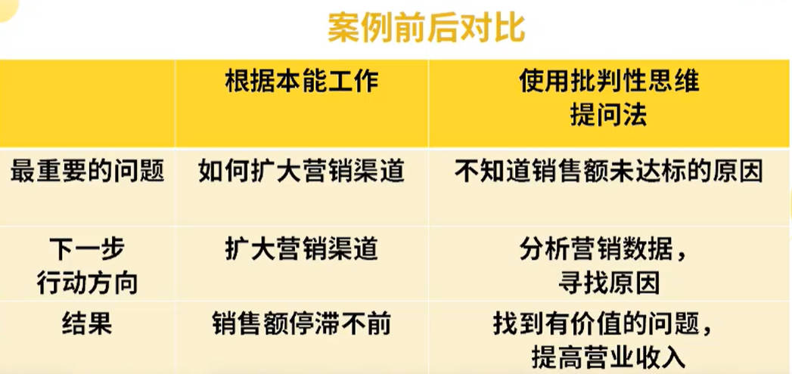

---
> **ARTS-week-11**
> 2024-03-17 08:26
---


## ARTS-2019 左耳听风社群活动--每周完成一个 ARTS
1.Algorithm: 每周至少做一个 leetcode 的算法题
2.Review: 阅读并点评至少一篇英文技术文章
3.Tip: 学习至少一个技术技巧
4.Share: 分享一篇有观点和思考的技术文章

### 1.Algorithm:

- [16. 最接近的三数之和](https://leetcode.cn/submissions/detail/512870219/)  
    + 思路：双指针

### 2.Review:

[🦾 如何使用 ChatGPT 学习编码（附示例）](https://dev.to/evergrowingdev/how-to-use-chatgpt-for-learning-to-code-with-examples-39e7)  

#### 使用 ChatGPT 帮助学习如何编码的初学者指南。
如果你还没有尝试过 ChatGPT，那么你要么太害怕 😱，要么完全不感兴趣 😒。

如果你不是后者，并且你正在学习编码或编码新手，那么本文可能正是你正在寻找的内容。

和许多人一样，自从 ChatGPT 和人工智能技术发布以来，我就对其着迷，现在我发现我每天都在使用它 - 几乎就像我使用互联网一样。

我特别敬畏 ChatGPT 如何帮助开发人员，从编写代码到调试，再到代码解释，它无疑增强了我开发软件的方式，并极大地改进了我的工作流程。

作为不断成长的开发者，任何可以改善我们的学习旅程并使事情更容易掌握的东西绝对值得充分探索。

这就是为什么我想分享一些在学习编码时使用 ChatGPT 的技巧和提示。

但在此之前，让我们先简要概述一下 ChatGPT 及其在交互式学习中可以发挥的作用：

#### ChatGPT 简而言之 🥜
ChatGPT（Chat Generative Pre-trained Transformer 的缩写）是 OpenAI 开发的一种先进的自然语言处理模型。

ChatGPT 的核心是一种机器学习模型，可以根据训练过的数据理解并生成类似人类的文本。

与通过特定响应进行硬编码的更简单的聊天机器人不同，ChatGPT 使用它学到的模式来进行更细致和信息丰富的交互。

ChatGPT 在编码学习过程中的重要性正变得无与伦比，它提供交互式和个性化的帮助，可以使从编码新手到专家的旅程比以往更快、更有吸引力。

ChatGPT 就像有一个友好的编码伙伴，他总是乐于聊天 🤖。

#### ChatGPT 互动学习的力量👩‍💻
互动学习是一种强调主动参与、参与和动态反馈的教育形式。

交互式学习不是被动地阅读或聆听静态内容，而是让你能够进行对话并实时提出澄清问题。

研究表明，这种类型的社交、对话式学习可以促进信息保留和更深入的理解。

交互式方法如此有效的原因是它们模仿了人类辅导课程的来回。

拥有一位能够根据你的理解差距调整解释并提供量身定制的示例的讲师是非常有益的。

这正是为什么通过像 ChatGPT 这样的人工智能系统进行学习与传统的编码教育方法相比具有令人难以置信的优势。

ChatGPT 允许你进行个性化对话，你可以控制对话的节奏和问题。

人工智能会模仿人类导师，根据你的需求不断调整其响应。

虽然独立学习占有一席之地，但提示 ChatGPT 的交互性质创建了一个反馈循环，可以加快进度。

能够通过定制的示例实时阐明概念是一个游戏规则的改变者。

现在让我们看看这对你有何帮助。

#### 使用 ChatGPT 学习编码 🤖
让我们看一些使用 ChatGPT 来提高编码技能的示例。

通过正确的提示，你可以利用 ChatGPT 广泛的编程知识来定制你的学习之旅：

##### 1 - 代码解释
ChatGPT 可以将复杂的编程概念分解为易于理解的语言。

无论你是想掌握循环的基础知识还是解开递归的奥秘，你都可以要求为你简化这些想法的解释。

提示示例：

“你能解释一下编程中的‘for’循环是什么吗？”

“JavaScript 中‘==’和‘===’有什么区别？”

“Python 中的函数闭包是如何工作的？”

“你能解释一下面向对象编程（OOP）的原理吗？”

“JavaScript 中的 async/await 是什么？它为何有用？”

这些提示旨在提取深入的解释，帮助阐明编码概念，使它们更容易理解。

##### 2 - 调试技巧
遇到无法解码的错误消息？

ChatGPT 可以帮助你了解常见错误消息并指导你完成调试过程。

虽然它无法执行代码，但它通常可以为你指明解决问题的正确方向。

提示示例：

“我在 C# 中不断收到‘NullReferenceException’。这是什么意思以及如何修复它？”

“我的 JavaScript 代码陷入了无限循环。我如何识别并打破它？”

“为什么我的 Web 应用程序中会出现‘跨源请求被阻止’错误？”

“为什么我在 Python 中遇到‘缩进错误’？”

“什么是 C 语言中的‘分段错误’以及如何调试它？”

这些提示的目的不仅是解决眼前的问题，还可以让你了解基本概念，提高你的调试技能以应对未来的挑战。

##### 3 - 练习
如果你想强化学习，ChatGPT 可以生成适合你技能水平的编码练习。

这些练习的范围从简单的任务（如反转字符串）到更复杂的挑战（如构建基本的 Web 应用程序）。

提示示例：

“你能给我一个初级练习来练习 Python 循环吗？”

“我想提高我的 SQL 查询技能。你能提供中级练习吗？”

“请给我一个练习来练习 HTML 和 CSS 布局技术。”

“我想练习 Java 中的递归。你能提供一个练习吗？”

“你能给我一个练习，让我练习在 JavaScript 中使用 RESTful API 吗？”

掌握编程的关键是持之以恒的练习。 这些提示可以帮助你保持这种做法，同时跟上你当前的水平和兴趣。

##### 4 - 代码审查和反馈
有一段代码但不确定它是否符合要求？

ChatGPT 可以为你提供快速审查，并提供有关如何提高代码质量、优化性能或使其更具可读性的建议。

提示示例：

“我编写了一个 Python 函数来求数字的阶乘。你能检查一下它的效率和可读性吗？”

“我已经为基本的待办事项列表应用程序编写了一些 JavaScript 代码。你能检查一下它是否遵循最佳实践吗？”

“我已经用 C++ 实现了排序算法。你能检查一下它是否有任何潜在的错误或优化吗？”

“我已经编写了用于数据库操作的 SQL 查询。你可以检查它们是否存在安全漏洞吗？”

“我正在为我的网站制作 CSS 样式表。你能否检查它的可维护性并提出改进建议？”

请记住，代码审查的目的不仅仅是发现错误，还要学习如何编写更干净、更高效、更易于维护的代码。

这些提示应该可以帮助你获得根据你的需求量身定制的有意义的反馈。

##### 5 - 项目想法和规划
当你准备好从练习转向实际项目时，ChatGPT 可以根据你的兴趣和技能水平帮助集思广益项目想法。

它甚至可以帮助概述项目的架构并提供最佳实践的指导。

提示示例：

“我是 Python 新手，对数据科学感兴趣。你能建议一个初学者级别的项目想法吗？”

“我想使用 React Native 构建一个移动应用程序。你有什么独特的项目想法吗？”

“我正在学习 Web 开发，想要构建一个作品集。你能帮我概述一下架构吗？”

“我想从事一个开源项目，但不知道从哪里开始。你能指导我吗？”

“我对使用 Unity 进行游戏开发很感兴趣。你能推荐一个可以在两个月内完成的项目吗？”

通过提出这些问题，你不仅会收到项目想法，还会获得规划执行的帮助，确保获得成功且具有教育意义的编码体验。

#### 使用 ChatGPT 最大化学习的额外技巧📝
我们探索了解锁 ChatGPT 编程知识的入门提示和想法，但一些额外的策略可以进一步增强你的学习体验：

❇️ 根据你的经验水平定制示例

在提示中明确你当前的技能水平，以便 ChatGPT 提供适当的内容。

询问“初级 Python 示例”与询问“高级 JavaScript 算法”会得到不同的答复。

将答案与你的基础知识相匹配。

❇️分解大目标

试图一次性学习所有内容是令人不知所措的。

根据之前的聊天历史记录，提示一系列的小步骤，这些步骤会增加复杂性。

将你的学习拼凑起来可以创造更多可实现的里程碑。

❇️ 接触新的语言和框架

提示 ChatGPT 提供你想要学习的语言或框架的代码示例。

例如，让它用 Python 解释一些东西，然后将其翻译成 JavaScript，这样在尝试学习一门新语言时就可以更容易地进行比较。

❇️ 像导师一样对待 ChatGPT

在进行编码练习时寻求批评、反馈和建议。 ChatGPT 可以充当教练，指导你完成项目并协作制定解决方案。

#### ChatGPT 在学习编码方面的局限性 🚫
虽然 ChatGPT 可以促进编码学习过程，但重要的是要有现实的期望并负责任地解决其缺点：

✅ 验证准确性

ChatGPT 有时会生成听起来合理但不正确的响应。 始终根据其他资源来证实其解释。

自己运行代码就是最好的验证。

❌请勿抄袭

使用 ChatGPT 的代码示例进行学习，而不是抄袭解决方案。

自己输入代码来培养真正的技能。 建议在适当的情况下注明归属。

🚫 无需亲自执行

与 IDE 不同，ChatGPT 无法执行代码或提供实时运行时反馈。 测试和调试技能需要你自己编码。

⛔️ 知识差距

ChatGPT 的知识虽然广泛，但落后于新的语言和框架。

补充官方文档以获取技术堆栈中的最新更新。

鉴于这些限制，我始终建议将 ChatGPT 与其他交互式编码平台、基于项目的课程和开发人员社区配对。

利用多种资源最大限度地提高现实世界的技能、创造性思维和经验学习。

设定适当的期望，同时利用其优势以获得更好的学习体验。

#### 结论
总之，ChatGPT 通过其交互式学习和广泛的知识，为促进编程学习过程提供了许多可能性。

提示 ChatGPT 进行简化解释、练习和反馈可以提供人工智能中前所未有的个性化指导。

这种对话方法可以让你填补知识空白，并按照自己的节奏迭代地发展技能。

然而，ChatGPT 也存在局限性，包括潜在的不准确性、无法执行代码以及缺乏人类创造力。

设定适当的期望并用其他资源补充学习对于最大限度地提高现实世界的编码技能非常重要。

我鼓励你尝试在自己的编码学习之旅中使用 ChatGPT。

开始关于你正在努力解决的概念的简单对话，并根据概述的原则从那里开始构建。

最重要的是，保持好奇心，继续自己编码，并且不要忘记探索这一不断发展的改变生活的技术。

人工智能不会取代开发人员，但使用人工智能的开发人员可能会取代它。

### 3.Tip:

#### Android EditText不可编辑单行显示能滑动查看内容

```
android:singleLine="true"
android:cursorVisible="false"
android:focusable="false"
android:focusableInTouchMode="false"  
```

#### 举一反三
问题很模糊时，如何追问出关键信息：
学会提出有意义的问题，对升职加薪有重大意义
- 解决问题之前，需要先确认问题是有效的，有意义的
- 提升问题有效性，往往给别人特别的启发，形成战略上的巨大改善
- 这样的人即是战略级人才，更容易得到重用
如何确认问题和任务的有效性？
01 批判性思维提问法
- 一种通过质疑和反思来提高思考有效性的思维方式
- 学会批判性思维的人，往往能够提出很关键的问题，并清晰、深刻的分析事物
《批判性思维工具》、《思维与立场》、《批判性思维》
- 1.问题的清晰度
- 2.问题的真实度
- 3.问题内涵逻辑的合理度
- 4.考虑其他肯能性

02 2W1H提问法(黄金思维圈)
- 1.What：任务的基本情况
- 2.Why：为什么要做任务？为什么是这样的？
- 3.How：怎么做
03 综合使用多种方法


### 4.Share:

[自定义View简单使用](https://mp.weixin.qq.com/s?__biz=MzI1MTAyNzM5Ng==&mid=2649949226&idx=1&sn=a31a68f497ee18210c947f9a50c99153&chksm=f1feee81c6896797dcfb30036359f04163dd542952d1b1204b78820141c570bdad1a000855be#rd)